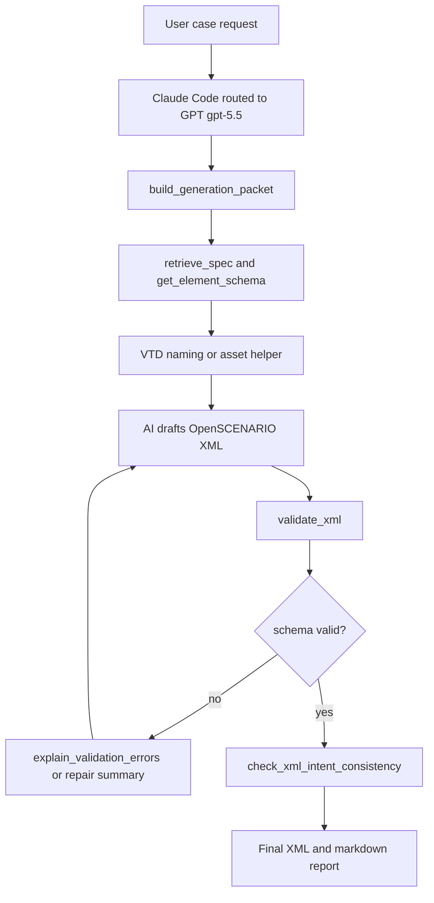
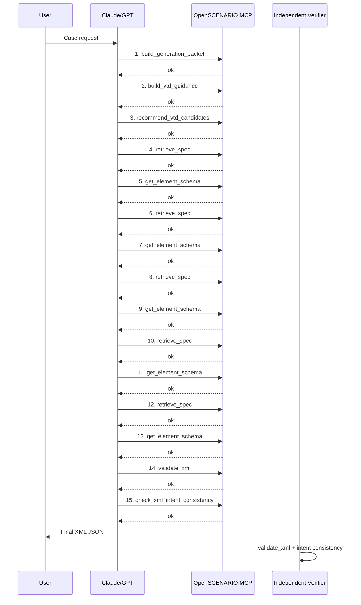

# AI-Primary OpenSCENARIO Full-Flow Case Run

- Generated at: `2026-05-19T03:27:07.701872Z`
- Primary AI: `Claude Code -> GPT gpt-5.5`
- System role: OpenSCENARIO MCP tools are query, naming, validation, and consistency helpers.
- Case directory: `docs/case-runs/lane-change-cn-ai-primary`
- Scenario XML: `docs/case-runs/lane-change-cn-ai-primary/lane_change_cn_ai_primary.xosc`
- Raw Claude/GPT stream: `docs/case-runs/lane-change-cn-ai-primary/claude-gpt-primary-stream.jsonl`
- Parsed tool interactions: `docs/case-runs/lane-change-cn-ai-primary/interactions.json`
- AI MCP interactions: `15`
- AI validation ok: `True`
- Independent validation ok: `True`
- Independent intent consistent: `True`

## Correct Claude -> GPT Routing

Anthropic's Claude Code LLM gateway documentation says an LLM gateway sits between Claude Code and model providers, uses `ANTHROPIC_AUTH_TOKEN` for gateway authentication, and recommends setting `ANTHROPIC_BASE_URL` to the gateway's Anthropic-format endpoint. Their settings documentation also lists `ANTHROPIC_AUTH_TOKEN` as the custom `Authorization` header value. Sources: https://docs.anthropic.com/en/docs/claude-code/llm-gateway and https://docs.anthropic.com/en/docs/claude-code/settings.

| Item | Value |
| --- | --- |
| Claude Code version | `2.1.12` |
| configured model | `gpt-5.5` |
| ANTHROPIC_BASE_URL | `https://xlabapi.com` |
| ANTHROPIC_MODEL | `gpt-5.5` |
| auth token | `configured, redacted, len=67` |
| modelUsage evidence | `gpt-5.5` |
| session turns | `22` |
| total cost USD | `0.2095956` |

The previous failure path was `Claude Code -> old gateway/model alias opus`, which made the gateway look for a Claude model. This corrected run is `Claude Code -> https://xlabapi.com Anthropic Messages endpoint -> gpt-5.5`.

## Case Request

Generate a VTD OpenSCENARIO case on an urban road in China: ego vehicle starts at 30 km/h; the scenario trigger is simulation time 5 seconds; at that trigger the ego vehicle performs a lane change to the left by one lane; the simulation stops at 20 seconds. Keep the XML minimal but schema-valid.

## Flow Visualization



## Interaction Sequence



## Tool Interaction Summary

| # | Tool | Status | Key Result |
| ---: | --- | --- | --- |
| 1 | `build_generation_packet` | `ok` | primary_elements=ScenarioObject,Storyboard,LaneChangeAction |
| 2 | `build_vtd_guidance` | `ok` | name_resolution=unresolved_runtime_asset -> ego |
| 3 | `recommend_vtd_candidates` | `ok` | name_resolution=unresolved_runtime_asset -> ego |
| 4 | `retrieve_spec` | `ok` | hits=3 |
| 5 | `get_element_schema` | `ok` | element=ScenarioObject |
| 6 | `retrieve_spec` | `ok` | hits=3 |
| 7 | `get_element_schema` | `ok` | element=Vehicle |
| 8 | `retrieve_spec` | `ok` | hits=3 |
| 9 | `get_element_schema` | `ok` | element=Storyboard |
| 10 | `retrieve_spec` | `ok` | hits=3 |
| 11 | `get_element_schema` | `ok` | element=LaneChangeAction |
| 12 | `retrieve_spec` | `ok` | hits=3 |
| 13 | `get_element_schema` | `ok` | element=SimulationTimeCondition |
| 14 | `validate_xml` | `ok` | ok=True, errors=0 |
| 15 | `check_xml_intent_consistency` | `ok` | intent_consistent=True, missing=[], extra=[] |

## AI Final Output

- Primary actor: `claude_code_gpt`
- Model: `gpt-5.5`
- AI validation_ok: `True`
- AI intent_consistent: `True`
- Remaining blockers: `[]`

## Independent Final Verification

```json
{
  "consistency": {
    "intent_consistent": true,
    "remaining_blockers": [],
    "xml_intent_check": {
      "extra": [],
      "matched": [
        "entity:ego",
        "lane_change",
        "speed_change",
        "simulation_time",
        "stop_trigger"
      ],
      "missing": []
    }
  },
  "validation": {
    "errors": [],
    "ok": true
  }
}
```

## Per-Step Claude/GPT <-> Tool I/O

The full raw stream is stored in `docs/case-runs/lane-change-cn-ai-primary/claude-gpt-primary-stream.jsonl`. The details below omit model hidden reasoning and show MCP tool calls/results only.

<details><summary>1. build_generation_packet - ok</summary>

**AI Tool Call**

```json
{
  "country_code": "CN",
  "request": "Generate a VTD OpenSCENARIO case on an urban road in China: ego vehicle starts at 30 km/h; the scenario trigger is simulation time 5 seconds; at that trigger the ego vehicle performs a lane change to the left by one lane; the simulation stops at 20 seconds. Keep the XML minimal but schema-valid.",
  "stage": "draft"
}
```

**Tool Result**

```json
{
  "intent": {
    "assumptions": [],
    "entities": [
      {
        "name": "ego",
        "role": "primary",
        "type": "Vehicle"
      }
    ],
    "environment": {},
    "init_actions": [],
    "map_context": {
      "road_type": "urban"
    },
    "parameters": [],
    "stop_conditions": [],
    "story_actions": [
      {
        "type": "lane_change"
      }
    ],
    "triggers": [
      {
        "type": "simulation_time",
        "unit": "s",
        "value": 5
      }
    ]
  },
  "naming_plan": {
    "country_code": "CN",
    "namespaces": [
      "scenario_object",
      "runtime_asset"
    ]
  },
  "open_questions": [
    "Which target lane should the lane change use?"
  ],
  "schema_plan": {
    "primary_elements": [
      "ScenarioObject",
      "Storyboard",
      "LaneChangeAction"
    ],
    "reference_closure": {
      "controller_names": [],
      "entity_names": [
        "ego"
      ],
      "parameter_names": [],
      "variable_names": []
    }
  },
  "validation_plan": {
    "consistency_tool": "check_xml_intent_consistency",
    "repair_budget": 3,
    "stage": "draft",
    "validate_tool": "validate_xml"
  },
  "vtd_plan": {
    "bridge_binding_count": 5,
    "country_code": "CN",
    "semantic_family_count": 7182
  }
}
```

</details>

<details><summary>2. build_vtd_guidance - ok</summary>

**AI Tool Call**

```json
{
  "asset_kind": "runtime_asset",
  "country_code": "CN",
  "name": "ego",
  "namespace": "runtime_asset",
  "query": "VTD ego vehicle runtime naming context for China urban OpenSCENARIO minimal scenario",
  "top_k": 3
}
```

**Tool Result**

```json
{
  "asset_kind": "runtime_asset",
  "asset_lookup": {
    "asset_kind": "runtime_asset",
    "country_code": "CN",
    "hits": [],
    "query": "VTD ego vehicle runtime naming context for China urban OpenSCENARIO minimal scenario",
    "top_k": 3
  },
  "country_code": "CN",
  "name": "ego",
  "name_resolution": {
    "alternatives": [],
    "canonical_target": "ego",
    "hard_constraint": true,
    "normalized_name": "ego",
    "reason": "Runtime asset names must map to a known VTD asset.",
    "rule_kind": "unresolved_runtime_asset",
    "severity": "warning",
    "source_paths": []
  },
  "namespace": "runtime_asset",
  "query": "VTD ego vehicle runtime naming context for China urban OpenSCENARIO minimal scenario",
  "user_override": false
}
```

</details>

<details><summary>3. recommend_vtd_candidates - ok</summary>

**AI Tool Call**

```json
{
  "asset_kind": "runtime_asset",
  "country_code": "CN",
  "namespace": "runtime_asset",
  "query": "ego vehicle runtime asset name for VTD OpenSCENARIO China urban road",
  "requested_name": "ego",
  "top_k": 3
}
```

**Tool Result**

```json
{
  "fallbacks": [],
  "name_resolution": {
    "alternatives": [],
    "canonical_target": "ego",
    "hard_constraint": true,
    "normalized_name": "ego",
    "reason": "Runtime asset names must map to a known VTD asset.",
    "rule_kind": "unresolved_runtime_asset",
    "severity": "warning",
    "source_paths": []
  },
  "ranking_reasons": [
    {
      "draft_names": [],
      "match_fields": [],
      "query": "ego vehicle runtime asset name for VTD OpenSCENARIO China urban road",
      "requested_name": "ego",
      "resolution_reason": "Runtime asset names must map to a known VTD asset."
    }
  ],
  "recommended": [],
  "rejected": [],
  "source_paths": []
}
```

</details>

<details><summary>4. retrieve_spec - ok</summary>

**AI Tool Call**

```json
{
  "kind": "element",
  "query": "ScenarioObject element OpenSCENARIO 1.4 minimal valid children Vehicle",
  "top_k": 3
}
```

**Tool Result**

```json
{
  "hits": [
    {
      "constraints": [
        "Required attributes: name",
        "Required children: CatalogReference, Vehicle, Pedestrian, MiscObject, ExternalObjectReference",
        "Content model: sequence",
        "Choice groups: CatalogReference | Vehicle | Pedestrian | MiscObject | ExternalObjectReference",
        "Child order: CatalogReference|Vehicle|Pedestrian|MiscObject|ExternalObjectReference -> ObjectController",
        "Contextual variants: Entities -> ScenarioObject"
      ],
      "kind": "element",
      "parent_contexts": [
        "Entities"
      ],
      "source_path": "knowledge/raw/schema/OpenSCENARIO.xsd#L1203; knowledge/raw/schema/OpenSCENARIO.xsd#L2094",
      "source_paths": [
        "knowledge/raw/schema/OpenSCENARIO.xsd#L1203",
        "knowledge/raw/schema/OpenSCENARIO.xsd#L2094"
      ],
      "strategy_summary": [
        "Resolve contextual variant before emitting this shared element name.",
        "Preserve child order: CatalogReference|Vehicle|Pedestrian|MiscObject|ExternalObjectReference -> ObjectController.",
        "Keep required children present: CatalogReference, Vehicle, Pedestrian, MiscObject, ExternalObjectReference."
      ],
      "summary": "Schema-derived ScenarioObject element with context-dependent type variants captured from the local XSD.",
      "title": "ScenarioObject"
    },
    {
      "constraints": [
        "Required children: CatalogReference, Vehicle, Pedestrian, MiscObject, ExternalObjectReference",
        "Content model: sequence",
        "Choice groups: CatalogReference | Vehicle | Pedestrian | MiscObject | ExternalObjectReference",
        "Child order: CatalogReference|Vehicle|Pedestrian|MiscObject|ExternalObjectReference -> ObjectController",
        "Contextual variants: EntityDistributionEntry -> ScenarioObjectTemplate"
      ],
      "kind": "element",
      "parent_contexts": [
        "EntityDistributionEntry"
      ],
      "source_path": "knowledge/raw/schema/OpenSCENARIO.xsd#L1243; knowledge/raw/schema/OpenSCENARIO.xsd#L2101",
      "source_paths": [
        "knowledge/raw/schema/OpenSCENARIO.xsd#L1243",
        "knowledge/raw/schema/OpenSCENARIO.xsd#L2101"
      ],
      "strategy_summary": [
        "Resolve contextual variant before emitting this shared element name.",
        "Preserve child order: CatalogReference|Vehicle|Pedestrian|MiscObject|ExternalObjectReference -> ObjectController.",
        "Keep required children present: CatalogReference, Vehicle, Pedestrian, MiscObject, ExternalObjectReference."
      ],
      "summary": "Schema-derived ScenarioObjectTemplate element with context-dependent type variants captured from the local XSD.",
      "title": "ScenarioObjectTemplate"
    },
    {
      "constraints": [
        "Required children: FileHeader, CatalogLocations, RoadNetwork, Entities, Storyboard, Catalog, ParameterValueDistribution",
        "Content model: sequence",
        "Choice groups: ParameterDeclarations | VariableDeclarations | MonitorDeclarations | CatalogLocations | RoadNetwork | Entities | Storyboard | Catalog | ParameterValueDistribution",
        "Child order: FileHeader -> ParameterDeclarations|VariableDeclarations|MonitorDeclarations|CatalogLocations|RoadNetwork|Entities|Storyboard|Catalog|ParameterValueDistribution",
        "Contextual variants: OpenScenario"
      ],
      "kind": "element",
      "source_path": "knowledge/raw/schema/OpenSCENARIO.xsd#L14; knowledge/raw/schema/OpenSCENARIO.xsd#L1618",
      "source_paths": [
        "knowledge/raw/schema/OpenSCENARIO.xsd#L14",
        "knowledge/raw/schema/OpenSCENARIO.xsd#L1618"
      ],
      "strategy_summary": [
        "Resolve contextual variant before emitting this shared element name.",
        "Preserve child order: FileHeader -> ParameterDeclarations|VariableDeclarations|MonitorDeclarations|CatalogLocations|RoadNetwork|Entities|Storyboard|Catalog|ParameterValueDistribution.",
        "Keep required children present: FileHeader, CatalogLocations, RoadNetwork, Entities, Storyboard, Catalog, ParameterValueDistribution."
      ],
      "summary": "Schema-derived OpenSCENARIO element with context-dependent type variants captured from the local XSD.",
      "title": "OpenSCENARIO"
    }
  ]
}
```

</details>

<details><summary>5. get_element_schema - ok</summary>

**AI Tool Call**

```json
{
  "element": "ScenarioObject"
}
```

**Tool Result**

```json
{
  "allowed_children": [
    {
      "cardinality": "1..1",
      "name": "CatalogReference"
    },
    {
      "cardinality": "1..1",
      "name": "Vehicle"
    },
    {
      "cardinality": "1..1",
      "name": "Pedestrian"
    },
    {
      "cardinality": "1..1",
      "name": "MiscObject"
    },
    {
      "cardinality": "1..1",
      "name": "ExternalObjectReference"
    },
    {
      "cardinality": "0..unbounded",
      "name": "ObjectController"
    }
  ],
  "child_groups": [
    {
      "cardinality": "1..1",
      "members": [
        "CatalogReference",
        "Vehicle",
        "Pedestrian",
        "MiscObject",
        "ExternalObjectReference"
      ]
    }
  ],
  "child_order": [
    "CatalogReference|Vehicle|Pedestrian|MiscObject|ExternalObjectReference",
    "ObjectController"
  ],
  "content_model_kind": "sequence",
  "contextual_variants": [
    {
      "deprecated": false,
      "parent_context": "Entities",
      "type_ref": "ScenarioObject"
    }
  ],
  "description": "Schema-derived ScenarioObject element with context-dependent type variants captured from the local XSD.",
  "element": "ScenarioObject",
  "enum_constraints": {},
  "multiplicity": {
    "CatalogReference": "1..1",
    "ExternalObjectReference": "1..1",
    "MiscObject": "1..1",
    "ObjectController": "0..unbounded",
    "Pedestrian": "1..1",
    "Vehicle": "1..1"
  },
  "optional_attributes": [],
  "parent_contexts": [
    "Entities"
  ],
  "required_attributes": [
    {
      "name": "name",
      "type": "String"
    }
  ],
  "semantic_constraints": [],
  "source_path": "knowledge/raw/schema/OpenSCENARIO.xsd#L1203; knowledge/raw/schema/OpenSCENARIO.xsd#L2094",
  "strategy": {
    "branch_selection": {
      "groups": [],
      "mode": "none"
    },
    "ordering": {
      "child_order": [
        "CatalogReference|Vehicle|Pedestrian|MiscObject|ExternalObjectReference",
        "ObjectController"
      ],
      "mode": "sequence"
    },
    "reference_requirements": [],
    "repair_priority": [
      "resolve_contextual_variant",
      "add_required_children",
      "enforce_sequence_order"
    ],
    "required_children": [
      "CatalogReference",
      "Vehicle",
      "Pedestrian",
      "MiscObject",
      "ExternalObjectReference"
    ],
    "structure_mode": "sequence",
    "variant_resolution": {
      "deprecated_variants": [],
      "parent_context": null,
      "preferred_variants": [
        {
          "deprecated": false,
          "parent_context": "Entities",
          "type_ref": "ScenarioObject"
        }
      ],
      "resolved_variant": null,
      "selection_required": true
    }
  }
}
```

</details>

<details><summary>6. retrieve_spec - ok</summary>

**AI Tool Call**

```json
{
  "kind": "element",
  "query": "Vehicle element OpenSCENARIO 1.4 minimal valid attributes BoundingBox Performance Axles Properties",
  "top_k": 3
}
```

**Tool Result**

```json
{
  "hits": [
    {
      "constraints": [
        "Required attributes: name, vehicleCategory",
        "Required children: BoundingBox, Performance, Axles",
        "Content model: all",
        "Contextual variants: Catalog -> Vehicle; EntityObject -> Vehicle"
      ],
      "kind": "element",
      "parent_contexts": [
        "Catalog",
        "EntityObject"
      ],
      "source_path": "knowledge/raw/schema/OpenSCENARIO.xsd#L485; knowledge/raw/schema/OpenSCENARIO.xsd#L644; knowledge/raw/schema/OpenSCENARIO.xsd#L924; knowledge/raw/schema/OpenSCENARIO.xsd#L1250; knowledge/raw/schema/OpenSCENARIO.xsd#L2600",
      "source_paths": [
        "knowledge/raw/schema/OpenSCENARIO.xsd#L485",
        "knowledge/raw/schema/OpenSCENARIO.xsd#L644",
        "knowledge/raw/schema/OpenSCENARIO.xsd#L924",
        "knowledge/raw/schema/OpenSCENARIO.xsd#L1250",
        "knowledge/raw/schema/OpenSCENARIO.xsd#L2600"
      ],
      "strategy_summary": [
        "Resolve contextual variant before emitting this shared element name.",
        "Keep required children present: BoundingBox, Performance, Axles."
      ],
      "summary": "Schema-derived Vehicle element with context-dependent type variants captured from the local XSD.",
      "title": "Vehicle"
    },
    {
      "constraints": [
        "Required children: Center, Dimensions",
        "Content model: all",
        "Contextual variants: Fog -> BoundingBox; MiscObject -> BoundingBox; Pedestrian -> BoundingBox; Vehicle -> BoundingBox"
      ],
      "kind": "element",
      "parent_contexts": [
        "Fog",
        "MiscObject",
        "Pedestrian",
        "Vehicle"
      ],
      "source_path": "knowledge/raw/schema/OpenSCENARIO.xsd#L882; knowledge/raw/schema/OpenSCENARIO.xsd#L1319; knowledge/raw/schema/OpenSCENARIO.xsd#L1559; knowledge/raw/schema/OpenSCENARIO.xsd#L1767; knowledge/raw/schema/OpenSCENARIO.xsd#L2603",
      "source_paths": [
        "knowledge/raw/schema/OpenSCENARIO.xsd#L882",
        "knowledge/raw/schema/OpenSCENARIO.xsd#L1319",
        "knowledge/raw/schema/OpenSCENARIO.xsd#L1559",
        "knowledge/raw/schema/OpenSCENARIO.xsd#L1767",
        "knowledge/raw/schema/OpenSCENARIO.xsd#L2603"
      ],
      "strategy_summary": [
        "Resolve contextual variant before emitting this shared element name.",
        "Keep required children present: Center, Dimensions."
      ],
      "summary": "Schema-derived BoundingBox element with context-dependent type variants captured from the local XSD.",
      "title": "BoundingBox"
    },
    {
      "constraints": [
        "Required children: FileHeader, CatalogLocations, RoadNetwork, Entities, Storyboard, Catalog, ParameterValueDistribution",
        "Content model: sequence",
        "Choice groups: ParameterDeclarations | VariableDeclarations | MonitorDeclarations | CatalogLocations | RoadNetwork | Entities | Storyboard | Catalog | ParameterValueDistribution",
        "Child order: FileHeader -> ParameterDeclarations|VariableDeclarations|MonitorDeclarations|CatalogLocations|RoadNetwork|Entities|Storyboard|Catalog|ParameterValueDistribution",
        "Contextual variants: OpenScenario"
      ],
      "kind": "element",
      "source_path": "knowledge/raw/schema/OpenSCENARIO.xsd#L14; knowledge/raw/schema/OpenSCENARIO.xsd#L1618",
      "source_paths": [
        "knowledge/raw/schema/OpenSCENARIO.xsd#L14",
        "knowledge/raw/schema/OpenSCENARIO.xsd#L1618"
      ],
      "strategy_summary": [
        "Resolve contextual variant before emitting this shared element name.",
        "Preserve child order: FileHeader -> ParameterDeclarations|VariableDeclarations|MonitorDeclarations|CatalogLocations|RoadNetwork|Entities|Storyboard|Catalog|ParameterValueDistribution.",
        "Keep required children present: FileHeader, CatalogLocations, RoadNetwork, Entities, Storyboard, Catalog, ParameterValueDistribution."
      ],
      "summary": "Schema-derived OpenSCENARIO element with context-dependent type variants captured from the local XSD.",
      "title": "OpenSCENARIO"
    }
  ]
}
```

</details>

<details><summary>7. get_element_schema - ok</summary>

**AI Tool Call**

```json
{
  "element": "Vehicle"
}
```

**Tool Result**

```json
{
  "allowed_children": [
    {
      "cardinality": "0..1",
      "name": "ParameterDeclarations"
    },
    {
      "cardinality": "1..1",
      "name": "BoundingBox"
    },
    {
      "cardinality": "1..1",
      "name": "Performance"
    },
    {
      "cardinality": "1..1",
      "name": "Axles"
    },
    {
      "cardinality": "0..1",
      "name": "Properties"
    },
    {
      "cardinality": "0..1",
      "name": "TrailerHitch"
    },
    {
      "cardinality": "0..1",
      "name": "TrailerCoupler"
    },
    {
      "cardinality": "0..1",
      "name": "Trailer"
    }
  ],
  "child_groups": [],
  "child_order": [],
  "content_model_kind": "all",
  "contextual_variants": [
    {
      "deprecated": false,
      "parent_context": "Catalog",
      "type_ref": "Vehicle"
    },
    {
      "deprecated": false,
      "parent_context": "EntityObject",
      "type_ref": "Vehicle"
    }
  ],
  "description": "Schema-derived Vehicle element with context-dependent type variants captured from the local XSD.",
  "element": "Vehicle",
  "enum_constraints": {
    "role": [
      "none",
      "agriculture",
      "ambulance",
      "civil",
      "construction",
      "dangerousGoodsTransport",
      "fire",
      "fireBrigade",
      "freightTransport",
      "garbageCollection",
      "military",
      "other",
      "police",
      "publicTransport",
      "roadAssistance",
      "roadsideAssistance",
      "specialTransport",
      "trafficControl"
    ],
    "vehicleCategory": [
      "aircraft",
      "bicycle",
      "bus",
      "car",
      "heavyTruck",
      "landVehicle",
      "micromobilityDevice",
      "motorbike",
      "motorcycle",
      "other",
      "semitractor",
      "semitrailer",
      "standupScooter",
      "trailer",
      "train",
      "tram",
      "truck",
      "van",
      "watercraft",
      "wheelchair",
      "workMachine"
    ]
  },
  "multiplicity": {
    "Axles": "1..1",
    "BoundingBox": "1..1",
    "ParameterDeclarations": "0..1",
    "Performance": "1..1",
    "Properties": "0..1",
    "Trailer": "0..1",
    "TrailerCoupler": "0..1",
    "TrailerHitch": "0..1"
  },
  "optional_attributes": [
    {
      "name": "mass",
      "type": "Double"
    },
    {
      "name": "model3d",
      "type": "String"
    },
    {
      "name": "role",
      "type": "Role"
    }
  ],
  "parent_contexts": [
    "Catalog",
    "EntityObject"
  ],
  "required_attributes": [
    {
      "name": "name",
      "type": "String"
    },
    {
      "name": "vehicleCategory",
      "type": "VehicleCategory"
    }
  ],
  "semantic_constraints": [],
  "source_path": "knowledge/raw/schema/OpenSCENARIO.xsd#L485; knowledge/raw/schema/OpenSCENARIO.xsd#L644; knowledge/raw/schema/OpenSCENARIO.xsd#L924; knowledge/raw/schema/OpenSCENARIO.xsd#L1250; knowledge/raw/schema/OpenSCENARIO.xsd#L2600",
  "strategy": {
    "branch_selection": {
      "groups": [],
      "mode": "none"
    },
    "ordering": {
      "child_order": [],
      "mode": "all"
    },
    "reference_requirements": [],
    "repair_priority": [
      "resolve_contextual_variant",
      "add_required_children"
    ],
    "required_children": [
      "BoundingBox",
      "Performance",
      "Axles"
    ],
    "structure_mode": "all",
    "variant_resolution": {
      "deprecated_variants": [],
      "parent_context": null,
      "preferred_variants": [
        {
          "deprecated": false,
          "parent_context": "Catalog",
          "type_ref": "Vehicle"
        },
        {
          "deprecated": false,
          "parent_context": "EntityObject",
          "type_ref": "Vehicle"
        }
      ],
      "resolved_variant": null,
      "selection_required": true
    }
  }
}
```

</details>

<details><summary>8. retrieve_spec - ok</summary>

**AI Tool Call**

```json
{
  "kind": "element",
  "query": "Storyboard element OpenSCENARIO 1.4 Init Story StopTrigger minimal valid structure",
  "top_k": 3
}
```

**Tool Result**

```json
{
  "hits": [
    {
      "constraints": [
        "Required children: Init",
        "Content model: sequence",
        "Child order: Init -> Story -> StopTrigger",
        "Contextual variants: ScenarioDefinition -> Storyboard"
      ],
      "kind": "element",
      "parent_contexts": [
        "ScenarioDefinition"
      ],
      "source_path": "knowledge/raw/schema/OpenSCENARIO.xsd#L2091; knowledge/raw/schema/OpenSCENARIO.xsd#L2206",
      "source_paths": [
        "knowledge/raw/schema/OpenSCENARIO.xsd#L2091",
        "knowledge/raw/schema/OpenSCENARIO.xsd#L2206"
      ],
      "strategy_summary": [
        "Resolve contextual variant before emitting this shared element name.",
        "Preserve child order: Init -> Story -> StopTrigger.",
        "Keep required children present: Init."
      ],
      "summary": "Schema-derived Storyboard element with context-dependent type variants captured from the local XSD.",
      "title": "Storyboard"
    },
    {
      "constraints": [
        "Required children: FileHeader, CatalogLocations, RoadNetwork, Entities, Storyboard, Catalog, ParameterValueDistribution",
        "Content model: sequence",
        "Choice groups: ParameterDeclarations | VariableDeclarations | MonitorDeclarations | CatalogLocations | RoadNetwork | Entities | Storyboard | Catalog | ParameterValueDistribution",
        "Child order: FileHeader -> ParameterDeclarations|VariableDeclarations|MonitorDeclarations|CatalogLocations|RoadNetwork|Entities|Storyboard|Catalog|ParameterValueDistribution",
        "Contextual variants: OpenScenario"
      ],
      "kind": "element",
      "source_path": "knowledge/raw/schema/OpenSCENARIO.xsd#L14; knowledge/raw/schema/OpenSCENARIO.xsd#L1618",
      "source_paths": [
        "knowledge/raw/schema/OpenSCENARIO.xsd#L14",
        "knowledge/raw/schema/OpenSCENARIO.xsd#L1618"
      ],
      "strategy_summary": [
        "Resolve contextual variant before emitting this shared element name.",
        "Preserve child order: FileHeader -> ParameterDeclarations|VariableDeclarations|MonitorDeclarations|CatalogLocations|RoadNetwork|Entities|Storyboard|Catalog|ParameterValueDistribution.",
        "Keep required children present: FileHeader, CatalogLocations, RoadNetwork, Entities, Storyboard, Catalog, ParameterValueDistribution."
      ],
      "summary": "Schema-derived OpenSCENARIO element with context-dependent type variants captured from the local XSD.",
      "title": "OpenSCENARIO"
    },
    {
      "constraints": [
        "Content model: sequence",
        "Child order: ConditionGroup"
      ],
      "kind": "element",
      "parent_contexts": [
        "Storyboard",
        "Act"
      ],
      "source_path": "knowledge/raw/schema/OpenSCENARIO.xsd#L774; knowledge/raw/schema/OpenSCENARIO.xsd#L2210; knowledge/raw/schema/OpenSCENARIO.xsd#L2497",
      "source_paths": [
        "knowledge/raw/schema/OpenSCENARIO.xsd#L774",
        "knowledge/raw/schema/OpenSCENARIO.xsd#L2210",
        "knowledge/raw/schema/OpenSCENARIO.xsd#L2497"
      ],
      "strategy_summary": [
        "Preserve child order: ConditionGroup."
      ],
      "summary": "Trigger instance used by Storyboard and Act. It is backed by the shared Trigger type; the schema permits zero ConditionGroup children, but an empty stop trigger never fires.",
      "title": "StopTrigger"
    }
  ]
}
```

</details>

<details><summary>9. get_element_schema - ok</summary>

**AI Tool Call**

```json
{
  "element": "Storyboard"
}
```

**Tool Result**

```json
{
  "allowed_children": [
    {
      "cardinality": "1..1",
      "name": "Init"
    },
    {
      "cardinality": "0..unbounded",
      "name": "Story"
    },
    {
      "cardinality": "0..1",
      "name": "StopTrigger"
    }
  ],
  "child_groups": [],
  "child_order": [
    "Init",
    "Story",
    "StopTrigger"
  ],
  "content_model_kind": "sequence",
  "contextual_variants": [
    {
      "deprecated": false,
      "parent_context": "ScenarioDefinition",
      "type_ref": "Storyboard"
    }
  ],
  "description": "Schema-derived Storyboard element with context-dependent type variants captured from the local XSD.",
  "element": "Storyboard",
  "enum_constraints": {},
  "multiplicity": {
    "Init": "1..1",
    "StopTrigger": "0..1",
    "Story": "0..unbounded"
  },
  "optional_attributes": [],
  "parent_contexts": [
    "ScenarioDefinition"
  ],
  "required_attributes": [],
  "semantic_constraints": [],
  "source_path": "knowledge/raw/schema/OpenSCENARIO.xsd#L2091; knowledge/raw/schema/OpenSCENARIO.xsd#L2206",
  "strategy": {
    "branch_selection": {
      "groups": [],
      "mode": "none"
    },
    "ordering": {
      "child_order": [
        "Init",
        "Story",
        "StopTrigger"
      ],
      "mode": "sequence"
    },
    "reference_requirements": [],
    "repair_priority": [
      "resolve_contextual_variant",
      "add_required_children",
      "enforce_sequence_order"
    ],
    "required_children": [
      "Init"
    ],
    "structure_mode": "sequence",
    "variant_resolution": {
      "deprecated_variants": [],
      "parent_context": null,
      "preferred_variants": [
        {
          "deprecated": false,
          "parent_context": "ScenarioDefinition",
          "type_ref": "Storyboard"
        }
      ],
      "resolved_variant": null,
      "selection_required": true
    }
  }
}
```

</details>

<details><summary>10. retrieve_spec - ok</summary>

**AI Tool Call**

```json
{
  "kind": "element",
  "query": "LaneChangeAction element OpenSCENARIO 1.4 AbsoluteTargetLane transition dynamics minimal valid structure",
  "top_k": 3
}
```

**Tool Result**

```json
{
  "hits": [
    {
      "constraints": [
        "Required attributes: dynamicsDimension, dynamicsShape, value",
        "Contextual variants: LaneChangeAction -> TransitionDynamics"
      ],
      "kind": "element",
      "parent_contexts": [
        "LaneChangeAction"
      ],
      "source_path": "knowledge/raw/schema/OpenSCENARIO.xsd#L177; knowledge/raw/schema/OpenSCENARIO.xsd#L191; knowledge/raw/schema/OpenSCENARIO.xsd#L206; knowledge/raw/schema/OpenSCENARIO.xsd#L1419; knowledge/raw/schema/OpenSCENARIO.xsd#L2488",
      "source_paths": [
        "knowledge/raw/schema/OpenSCENARIO.xsd#L177",
        "knowledge/raw/schema/OpenSCENARIO.xsd#L191",
        "knowledge/raw/schema/OpenSCENARIO.xsd#L206",
        "knowledge/raw/schema/OpenSCENARIO.xsd#L1419",
        "knowledge/raw/schema/OpenSCENARIO.xsd#L2488"
      ],
      "strategy_summary": [
        "Resolve contextual variant before emitting this shared element name."
      ],
      "summary": "Schema-derived LaneChangeActionDynamics element with context-dependent type variants captured from the local XSD.",
      "title": "LaneChangeActionDynamics"
    },
    {
      "constraints": [
        "Required children: LaneChangeActionDynamics, LaneChangeTarget",
        "Content model: all",
        "Contextual variants: LateralAction -> LaneChangeAction"
      ],
      "kind": "element",
      "parent_contexts": [
        "LateralAction"
      ],
      "source_path": "knowledge/raw/schema/OpenSCENARIO.xsd#L1417; knowledge/raw/schema/OpenSCENARIO.xsd#L1459",
      "source_paths": [
        "knowledge/raw/schema/OpenSCENARIO.xsd#L1417",
        "knowledge/raw/schema/OpenSCENARIO.xsd#L1459"
      ],
      "strategy_summary": [
        "Resolve contextual variant before emitting this shared element name.",
        "Keep required children present: LaneChangeActionDynamics, LaneChangeTarget."
      ],
      "summary": "Schema-derived LaneChangeAction element with context-dependent type variants captured from the local XSD.",
      "title": "LaneChangeAction"
    },
    {
      "constraints": [
        "Required children: RelativeTargetLane, AbsoluteTargetLane",
        "Content model: choice",
        "Choice groups: RelativeTargetLane | AbsoluteTargetLane",
        "Child order: RelativeTargetLane|AbsoluteTargetLane",
        "Select exactly one of: RelativeTargetLane, AbsoluteTargetLane.",
        "Contextual variants: LaneChangeAction -> LaneChangeTarget"
      ],
      "kind": "element",
      "parent_contexts": [
        "LaneChangeAction"
      ],
      "source_path": "knowledge/raw/schema/OpenSCENARIO.xsd#L1420; knowledge/raw/schema/OpenSCENARIO.xsd#L1424",
      "source_paths": [
        "knowledge/raw/schema/OpenSCENARIO.xsd#L1420",
        "knowledge/raw/schema/OpenSCENARIO.xsd#L1424"
      ],
      "strategy_summary": [
        "Resolve contextual variant before emitting this shared element name.",
        "Select exactly one branch from: RelativeTargetLane, AbsoluteTargetLane.",
        "Preserve child order: RelativeTargetLane|AbsoluteTargetLane.",
        "Keep required children present: RelativeTargetLane, AbsoluteTargetLane."
      ],
      "summary": "Schema-derived LaneChangeTarget element with context-dependent type variants captured from the local XSD.",
      "title": "LaneChangeTarget"
    }
  ]
}
```

</details>

<details><summary>11. get_element_schema - ok</summary>

**AI Tool Call**

```json
{
  "element": "LaneChangeAction"
}
```

**Tool Result**

```json
{
  "allowed_children": [
    {
      "cardinality": "1..1",
      "name": "LaneChangeActionDynamics"
    },
    {
      "cardinality": "1..1",
      "name": "LaneChangeTarget"
    }
  ],
  "child_groups": [],
  "child_order": [],
  "content_model_kind": "all",
  "contextual_variants": [
    {
      "deprecated": false,
      "parent_context": "LateralAction",
      "type_ref": "LaneChangeAction"
    }
  ],
  "description": "Schema-derived LaneChangeAction element with context-dependent type variants captured from the local XSD.",
  "element": "LaneChangeAction",
  "enum_constraints": {},
  "multiplicity": {
    "LaneChangeActionDynamics": "1..1",
    "LaneChangeTarget": "1..1"
  },
  "optional_attributes": [
    {
      "name": "targetLaneOffset",
      "type": "Double"
    }
  ],
  "parent_contexts": [
    "LateralAction"
  ],
  "required_attributes": [],
  "semantic_constraints": [],
  "source_path": "knowledge/raw/schema/OpenSCENARIO.xsd#L1417; knowledge/raw/schema/OpenSCENARIO.xsd#L1459",
  "strategy": {
    "branch_selection": {
      "groups": [],
      "mode": "none"
    },
    "ordering": {
      "child_order": [],
      "mode": "all"
    },
    "reference_requirements": [],
    "repair_priority": [
      "resolve_contextual_variant",
      "add_required_children"
    ],
    "required_children": [
      "LaneChangeActionDynamics",
      "LaneChangeTarget"
    ],
    "structure_mode": "all",
    "variant_resolution": {
      "deprecated_variants": [],
      "parent_context": null,
      "preferred_variants": [
        {
          "deprecated": false,
          "parent_context": "LateralAction",
          "type_ref": "LaneChangeAction"
        }
      ],
      "resolved_variant": null,
      "selection_required": true
    }
  }
}
```

</details>

<details><summary>12. retrieve_spec - ok</summary>

**AI Tool Call**

```json
{
  "kind": "element",
  "query": "SimulationTimeCondition element OpenSCENARIO 1.4 attributes value rule used in trigger",
  "top_k": 3
}
```

**Tool Result**

```json
{
  "hits": [
    {
      "constraints": [
        "Required attributes: rule, value"
      ],
      "kind": "element",
      "parent_contexts": [
        "ByValueCondition"
      ],
      "source_path": "knowledge/raw/schema/OpenSCENARIO.xsd#L549; knowledge/raw/schema/OpenSCENARIO.xsd#L2133",
      "source_paths": [
        "knowledge/raw/schema/OpenSCENARIO.xsd#L549",
        "knowledge/raw/schema/OpenSCENARIO.xsd#L2133"
      ],
      "summary": "Simulation-time trigger condition. It compares the running storyboard's simulation time against a required value using the supplied rule.",
      "title": "SimulationTimeCondition"
    },
    {
      "constraints": [
        "Required attributes: entityRef, freespace, rule, value",
        "Some contextual variants of this element are deprecated in the local XSD.",
        "Deprecated variants present",
        "Contextual variants: EntityCondition -> TimeHeadwayCondition (deprecated)"
      ],
      "kind": "element",
      "parent_contexts": [
        "EntityCondition"
      ],
      "source_path": "knowledge/raw/schema/OpenSCENARIO.xsd#L147; knowledge/raw/schema/OpenSCENARIO.xsd#L468; knowledge/raw/schema/OpenSCENARIO.xsd#L533; knowledge/raw/schema/OpenSCENARIO.xsd#L549; knowledge/raw/schema/OpenSCENARIO.xsd#L1219; knowledge/raw/schema/OpenSCENARIO.xsd#L2247",
      "source_paths": [
        "knowledge/raw/schema/OpenSCENARIO.xsd#L147",
        "knowledge/raw/schema/OpenSCENARIO.xsd#L468",
        "knowledge/raw/schema/OpenSCENARIO.xsd#L533",
        "knowledge/raw/schema/OpenSCENARIO.xsd#L549",
        "knowledge/raw/schema/OpenSCENARIO.xsd#L1219",
        "knowledge/raw/schema/OpenSCENARIO.xsd#L2247"
      ],
      "strategy_summary": [
        "Resolve contextual variant before emitting this shared element name.",
        "Wire required entity reference: entityRef."
      ],
      "summary": "Schema-derived TimeHeadwayCondition element with context-dependent type variants captured from the local XSD.",
      "title": "TimeHeadwayCondition"
    },
    {
      "constraints": [
        "Required attributes: freespace, rule, value",
        "Required children: TimeToCollisionConditionTarget",
        "Content model: all",
        "Some contextual variants of this element are deprecated in the local XSD.",
        "Deprecated variants present",
        "Contextual variants: EntityCondition -> TimeToCollisionCondition (deprecated)"
      ],
      "kind": "element",
      "parent_contexts": [
        "EntityCondition"
      ],
      "source_path": "knowledge/raw/schema/OpenSCENARIO.xsd#L147; knowledge/raw/schema/OpenSCENARIO.xsd#L468; knowledge/raw/schema/OpenSCENARIO.xsd#L533; knowledge/raw/schema/OpenSCENARIO.xsd#L549; knowledge/raw/schema/OpenSCENARIO.xsd#L1220; knowledge/raw/schema/OpenSCENARIO.xsd#L2273",
      "source_paths": [
        "knowledge/raw/schema/OpenSCENARIO.xsd#L147",
        "knowledge/raw/schema/OpenSCENARIO.xsd#L468",
        "knowledge/raw/schema/OpenSCENARIO.xsd#L533",
        "knowledge/raw/schema/OpenSCENARIO.xsd#L549",
        "knowledge/raw/schema/OpenSCENARIO.xsd#L1220",
        "knowledge/raw/schema/OpenSCENARIO.xsd#L2273"
      ],
      "strategy_summary": [
        "Resolve contextual variant before emitting this shared element name.",
        "Keep required children present: TimeToCollisionConditionTarget."
      ],
      "summary": "Schema-derived TimeToCollisionCondition element with context-dependent type variants captured from the local XSD.",
      "title": "TimeToCollisionCondition"
    }
  ]
}
```

</details>

<details><summary>13. get_element_schema - ok</summary>

**AI Tool Call**

```json
{
  "element": "SimulationTimeCondition"
}
```

**Tool Result**

```json
{
  "allowed_children": [],
  "child_groups": [],
  "child_order": [],
  "content_model_kind": "",
  "contextual_variants": [],
  "description": "Simulation-time trigger condition. It compares the running storyboard's simulation time against a required value using the supplied rule.",
  "element": "SimulationTimeCondition",
  "enum_constraints": {
    "rule": [
      "equalTo",
      "greaterThan",
      "lessThan",
      "greaterOrEqual",
      "lessOrEqual",
      "notEqualTo"
    ]
  },
  "multiplicity": {},
  "optional_attributes": [],
  "parent_contexts": [
    "ByValueCondition"
  ],
  "required_attributes": [
    {
      "name": "rule",
      "type": "Rule"
    },
    {
      "name": "value",
      "type": "Double"
    }
  ],
  "semantic_constraints": [],
  "source_path": "knowledge/raw/schema/OpenSCENARIO.xsd#L549; knowledge/raw/schema/OpenSCENARIO.xsd#L2133",
  "strategy": {
    "branch_selection": {
      "groups": [],
      "mode": "none"
    },
    "ordering": {
      "child_order": [],
      "mode": "none"
    },
    "reference_requirements": [],
    "repair_priority": [],
    "required_children": [],
    "structure_mode": "leaf",
    "variant_resolution": {
      "deprecated_variants": [],
      "parent_context": null,
      "preferred_variants": [],
      "resolved_variant": null,
      "selection_required": false
    }
  }
}
```

</details>

<details><summary>14. validate_xml - ok</summary>

**AI Tool Call**

```json
{
  "schema_version": "1.4.0",
  "xml": "<?xml version=\"1.0\" encoding=\"UTF-8\"?>\n<OpenSCENARIO>\n  <FileHeader revMajor=\"1\" revMinor=\"4\" date=\"2026-05-19T00:00:00\" description=\"China urban ego lane change left at 5 seconds\" author=\"claude_code_gpt\"/>\n  <CatalogLocations/>\n  <RoadNetwork/>\n  <Entities>\n    <ScenarioObject name=\"ego\">\n      <Vehicle name=\"ego_vehicle\" vehicleCategory=\"car\">\n        <BoundingBox>\n          <Center x=\"1.5\" y=\"0.0\" z=\"0.9\"/>\n          <Dimensions width=\"1.8\" length=\"4.5\" height=\"1.8\"/>\n        </BoundingBox>\n        <Performance maxSpeed=\"69.444\" maxAcceleration=\"10.0\" maxDeceleration=\"10.0\"/>\n        <Axles>\n          <FrontAxle maxSteering=\"0.5\" wheelDiameter=\"0.6\" trackWidth=\"1.6\" positionX=\"3.0\" positionZ=\"0.3\"/>\n          <RearAxle maxSteering=\"0.0\" wheelDiameter=\"0.6\" trackWidth=\"1.6\" positionX=\"0.0\" positionZ=\"0.3\"/>\n        </Axles>\n      </Vehicle>\n    </ScenarioObject>\n  </Entities>\n  <Storyboard>\n    <Init>\n      <Actions>\n        <Private entityRef=\"ego\">\n          <PrivateAction>\n            <LongitudinalAction>\n              <SpeedAction>\n                <SpeedActionDynamics dynamicsShape=\"step\" value=\"0.0\" dynamicsDimension=\"time\"/>\n                <SpeedActionTarget>\n                  <AbsoluteTargetSpeed value=\"8.333333\"/>\n                </SpeedActionTarget>\n              </SpeedAction>\n            </LongitudinalAction>\n          </PrivateAction>\n        </Private>\n      </Actions>\n    </Init>\n    <Story name=\"LaneChangeStory\">\n      <Act name=\"LaneChangeAct\">\n        <ManeuverGroup name=\"LaneChangeGroup\" maximumExecutionCount=\"1\">\n          <Actors selectTriggeringEntities=\"false\">\n            <EntityRef entityRef=\"ego\"/>\n          </Actors>\n          <Maneuver name=\"LaneChangeManeuver\">\n            <Event name=\"LaneChangeEvent\" priority=\"overwrite\">\n              <Action name=\"LaneChangeLeft\">\n                <PrivateAction>\n                  <LateralAction>\n                    <LaneChangeAction>\n                      <LaneChangeActionDynamics dynamicsShape=\"sinusoidal\" value=\"3.0\" dynamicsDimension=\"time\"/>\n                      <LaneChangeTarget>\n                        <AbsoluteTargetLane value=\"-1\"/>\n                      </LaneChangeTarget>\n                    </LaneChangeAction>\n                  </LateralAction>\n                </PrivateAction>\n              </Action>\n              <StartTrigger>\n                <ConditionGroup>\n                  <Condition name=\"StartAtFiveSeconds\" delay=\"0.0\" conditionEdge=\"rising\">\n                    <ByValueCondition>\n                      <SimulationTimeCondition value=\"5.0\" rule=\"greaterOrEqual\"/>\n                    </ByValueCondition>\n                  </Condition>\n                </ConditionGroup>\n              </StartTrigger>\n            </Event>\n          </Maneuver>\n        </ManeuverGroup>\n        <StartTrigger>\n          <ConditionGroup>\n            <Condition name=\"ActStartAtFiveSeconds\" delay=\"0.0\" conditionEdge=\"rising\">\n              <ByValueCondition>\n                <SimulationTimeCondition value=\"5.0\" rule=\"greaterOrEqual\"/>\n              </ByValueCondition>\n            </Condition>\n          </ConditionGroup>\n        </StartTrigger>\n        <StopTrigger/>\n      </Act>\n    </Story>\n    <StopTrigger>\n      <ConditionGroup>\n        <Condition name=\"StopAtTwentySeconds\" delay=\"0.0\" conditionEdge=\"rising\">\n          <ByValueCondition>\n            <SimulationTimeCondition value=\"20.0\" rule=\"greaterOrEqual\"/>\n          </ByValueCondition>\n        </Condition>\n      </ConditionGroup>\n    </StopTrigger>\n  </Storyboard>\n</OpenSCENARIO>"
}
```

**Tool Result**

```json
{
  "errors": [],
  "ok": true
}
```

</details>

<details><summary>15. check_xml_intent_consistency - ok</summary>

**AI Tool Call**

```json
{
  "checklist": [
    "ego",
    "lane_change",
    "speed_change",
    "simulation_time",
    "stop_trigger"
  ],
  "intent": {
    "assumptions": [
      "The target lane is resolved as AbsoluteTargetLane value=\"-1\"."
    ],
    "entities": [
      {
        "name": "ego",
        "role": "primary",
        "type": "Vehicle"
      }
    ],
    "environment": {},
    "init_actions": [
      {
        "entity": "ego",
        "mode": "initial_speed",
        "source_unit": "km/h",
        "source_value": 30,
        "type": "speed_change",
        "unit": "m/s",
        "value": 8.333333
      }
    ],
    "map_context": {
      "country_code": "CN",
      "road_type": "urban"
    },
    "parameters": [],
    "stop_conditions": [
      {
        "type": "simulation_time",
        "unit": "s",
        "value": 20
      }
    ],
    "story_actions": [
      {
        "entity": "ego",
        "mode": "initial_speed",
        "type": "speed_change"
      },
      {
        "direction": "left",
        "entity": "ego",
        "target": {
          "type": "AbsoluteTargetLane",
          "value": "-1"
        },
        "type": "lane_change"
      }
    ],
    "triggers": [
      {
        "type": "simulation_time",
        "unit": "s",
        "value": 5
      }
    ]
  },
  "xml": "<?xml version=\"1.0\" encoding=\"UTF-8\"?>\n<OpenSCENARIO>\n  <FileHeader revMajor=\"1\" revMinor=\"4\" date=\"2026-05-19T00:00:00\" description=\"China urban ego lane change left at 5 seconds\" author=\"claude_code_gpt\"/>\n  <CatalogLocations/>\n  <RoadNetwork/>\n  <Entities>\n    <ScenarioObject name=\"ego\">\n      <Vehicle name=\"ego_vehicle\" vehicleCategory=\"car\">\n        <BoundingBox>\n          <Center x=\"1.5\" y=\"0.0\" z=\"0.9\"/>\n          <Dimensions width=\"1.8\" length=\"4.5\" height=\"1.8\"/>\n        </BoundingBox>\n        <Performance maxSpeed=\"69.444\" maxAcceleration=\"10.0\" maxDeceleration=\"10.0\"/>\n        <Axles>\n          <FrontAxle maxSteering=\"0.5\" wheelDiameter=\"0.6\" trackWidth=\"1.6\" positionX=\"3.0\" positionZ=\"0.3\"/>\n          <RearAxle maxSteering=\"0.0\" wheelDiameter=\"0.6\" trackWidth=\"1.6\" positionX=\"0.0\" positionZ=\"0.3\"/>\n        </Axles>\n      </Vehicle>\n    </ScenarioObject>\n  </Entities>\n  <Storyboard>\n    <Init>\n      <Actions>\n        <Private entityRef=\"ego\">\n          <PrivateAction>\n            <LongitudinalAction>\n              <SpeedAction>\n                <SpeedActionDynamics dynamicsShape=\"step\" value=\"0.0\" dynamicsDimension=\"time\"/>\n                <SpeedActionTarget>\n                  <AbsoluteTargetSpeed value=\"8.333333\"/>\n                </SpeedActionTarget>\n              </SpeedAction>\n            </LongitudinalAction>\n          </PrivateAction>\n        </Private>\n      </Actions>\n    </Init>\n    <Story name=\"LaneChangeStory\">\n      <Act name=\"LaneChangeAct\">\n        <ManeuverGroup name=\"LaneChangeGroup\" maximumExecutionCount=\"1\">\n          <Actors selectTriggeringEntities=\"false\">\n            <EntityRef entityRef=\"ego\"/>\n          </Actors>\n          <Maneuver name=\"LaneChangeManeuver\">\n            <Event name=\"LaneChangeEvent\" priority=\"overwrite\">\n              <Action name=\"LaneChangeLeft\">\n                <PrivateAction>\n                  <LateralAction>\n                    <LaneChangeAction>\n                      <LaneChangeActionDynamics dynamicsShape=\"sinusoidal\" value=\"3.0\" dynamicsDimension=\"time\"/>\n                      <LaneChangeTarget>\n                        <AbsoluteTargetLane value=\"-1\"/>\n                      </LaneChangeTarget>\n                    </LaneChangeAction>\n                  </LateralAction>\n                </PrivateAction>\n              </Action>\n              <StartTrigger>\n                <ConditionGroup>\n                  <Condition name=\"StartAtFiveSeconds\" delay=\"0.0\" conditionEdge=\"rising\">\n                    <ByValueCondition>\n                      <SimulationTimeCondition value=\"5.0\" rule=\"greaterOrEqual\"/>\n                    </ByValueCondition>\n                  </Condition>\n                </ConditionGroup>\n              </StartTrigger>\n            </Event>\n          </Maneuver>\n        </ManeuverGroup>\n        <StartTrigger>\n          <ConditionGroup>\n            <Condition name=\"ActStartAtFiveSeconds\" delay=\"0.0\" conditionEdge=\"rising\">\n              <ByValueCondition>\n                <SimulationTimeCondition value=\"5.0\" rule=\"greaterOrEqual\"/>\n              </ByValueCondition>\n            </Condition>\n          </ConditionGroup>\n        </StartTrigger>\n        <StopTrigger/>\n      </Act>\n    </Story>\n    <StopTrigger>\n      <ConditionGroup>\n        <Condition name=\"StopAtTwentySeconds\" delay=\"0.0\" conditionEdge=\"rising\">\n          <ByValueCondition>\n            <SimulationTimeCondition value=\"20.0\" rule=\"greaterOrEqual\"/>\n          </ByValueCondition>\n        </Condition>\n      </ConditionGroup>\n    </StopTrigger>\n  </Storyboard>\n</OpenSCENARIO>"
}
```

**Tool Result**

```json
{
  "intent_consistent": true,
  "remaining_blockers": [],
  "xml_intent_check": {
    "extra": [],
    "matched": [
      "entity:ego",
      "lane_change",
      "speed_change",
      "simulation_time",
      "stop_trigger"
    ],
    "missing": []
  }
}
```

</details>

## Generated XML

```xml
<?xml version="1.0" encoding="UTF-8"?>
<OpenSCENARIO>
  <FileHeader revMajor="1" revMinor="4" date="2026-05-19T00:00:00" description="China urban ego lane change left at 5 seconds" author="claude_code_gpt"/>
  <CatalogLocations/>
  <RoadNetwork/>
  <Entities>
    <ScenarioObject name="ego">
      <Vehicle name="ego_vehicle" vehicleCategory="car">
        <BoundingBox>
          <Center x="1.5" y="0.0" z="0.9"/>
          <Dimensions width="1.8" length="4.5" height="1.8"/>
        </BoundingBox>
        <Performance maxSpeed="69.444" maxAcceleration="10.0" maxDeceleration="10.0"/>
        <Axles>
          <FrontAxle maxSteering="0.5" wheelDiameter="0.6" trackWidth="1.6" positionX="3.0" positionZ="0.3"/>
          <RearAxle maxSteering="0.0" wheelDiameter="0.6" trackWidth="1.6" positionX="0.0" positionZ="0.3"/>
        </Axles>
      </Vehicle>
    </ScenarioObject>
  </Entities>
  <Storyboard>
    <Init>
      <Actions>
        <Private entityRef="ego">
          <PrivateAction>
            <LongitudinalAction>
              <SpeedAction>
                <SpeedActionDynamics dynamicsShape="step" value="0.0" dynamicsDimension="time"/>
                <SpeedActionTarget>
                  <AbsoluteTargetSpeed value="8.333333"/>
                </SpeedActionTarget>
              </SpeedAction>
            </LongitudinalAction>
          </PrivateAction>
        </Private>
      </Actions>
    </Init>
    <Story name="LaneChangeStory">
      <Act name="LaneChangeAct">
        <ManeuverGroup name="LaneChangeGroup" maximumExecutionCount="1">
          <Actors selectTriggeringEntities="false">
            <EntityRef entityRef="ego"/>
          </Actors>
          <Maneuver name="LaneChangeManeuver">
            <Event name="LaneChangeEvent" priority="overwrite">
              <Action name="LaneChangeLeft">
                <PrivateAction>
                  <LateralAction>
                    <LaneChangeAction>
                      <LaneChangeActionDynamics dynamicsShape="sinusoidal" value="3.0" dynamicsDimension="time"/>
                      <LaneChangeTarget>
                        <AbsoluteTargetLane value="-1"/>
                      </LaneChangeTarget>
                    </LaneChangeAction>
                  </LateralAction>
                </PrivateAction>
              </Action>
              <StartTrigger>
                <ConditionGroup>
                  <Condition name="StartAtFiveSeconds" delay="0.0" conditionEdge="rising">
                    <ByValueCondition>
                      <SimulationTimeCondition value="5.0" rule="greaterOrEqual"/>
                    </ByValueCondition>
                  </Condition>
                </ConditionGroup>
              </StartTrigger>
            </Event>
          </Maneuver>
        </ManeuverGroup>
        <StartTrigger>
          <ConditionGroup>
            <Condition name="ActStartAtFiveSeconds" delay="0.0" conditionEdge="rising">
              <ByValueCondition>
                <SimulationTimeCondition value="5.0" rule="greaterOrEqual"/>
              </ByValueCondition>
            </Condition>
          </ConditionGroup>
        </StartTrigger>
        <StopTrigger/>
      </Act>
    </Story>
    <StopTrigger>
      <ConditionGroup>
        <Condition name="StopAtTwentySeconds" delay="0.0" conditionEdge="rising">
          <ByValueCondition>
            <SimulationTimeCondition value="20.0" rule="greaterOrEqual"/>
          </ByValueCondition>
        </Condition>
      </ConditionGroup>
    </StopTrigger>
  </Storyboard>
</OpenSCENARIO>
```

## Notes

- API credentials are redacted from all generated artifacts.
- The AI, not the local script, drafted the XML. The local script only launched Claude Code, parsed its stream, saved artifacts, and independently verified the final XML.
- The report keeps failed helper calls when they occur because they are part of the real AI/tool interaction trace.
