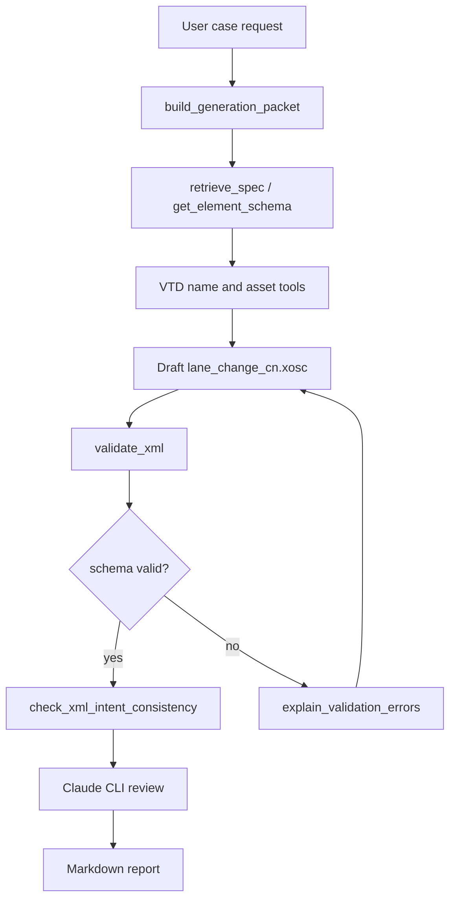
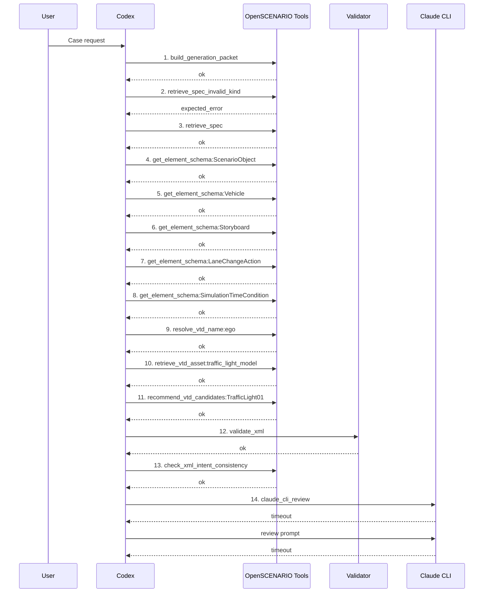

# OpenSCENARIO Full-Flow Case Run

- Generated at: `2026-05-19T02:24:39.069720Z`
- Case directory: `docs/case-runs/lane-change-cn`
- Scenario XML: `docs/case-runs/lane-change-cn/lane_change_cn.xosc`
- Interaction log: `docs/case-runs/lane-change-cn/interactions.json`
- Validation ok: `True`
- Intent consistent: `True`

## Codex / Account Configuration

| Item | Value |
| --- | --- |
| model_provider | `azure` |
| model | `gpt-5.5` |
| reasoning | `xhigh` |
| base_url | `https://xlabapi.com/v1` |
| auth mode | `apikey` |
| API key | configured, redacted |

## Case Request

Generate a VTD OpenSCENARIO case on an urban road in China: ego vehicle starts at 30 km/h; the scenario trigger is simulation time 5 seconds; at that trigger the ego vehicle performs a lane change to the left by one lane; the simulation stops at 20 seconds. Keep the XML minimal but schema-valid.

## Flow Visualization



## Interaction Timeline



## Tool Interaction Summary

| # | Tool | Status | Key Result |
| ---: | --- | --- | --- |
| 1 | `build_generation_packet` | `ok` | primary_elements=ScenarioObject,Storyboard,LaneChangeAction |
| 2 | `retrieve_spec_invalid_kind` | `expected_error` | ValueError: Unsupported retrieve_spec kind: schema. Expected one of ['attribute', 'concept', 'element', 'error']. |
| 3 | `retrieve_spec` | `ok` | hits=6 |
| 4 | `get_element_schema:ScenarioObject` | `ok` | {'allowed_children': [{'cardinality': '1..1', 'name': 'CatalogReference'}, {'cardinality': '1..1', 'name': 'Vehicle'}, {'cardinality': '1..1', 'name': 'Pedestri |
| 5 | `get_element_schema:Vehicle` | `ok` | {'allowed_children': [{'cardinality': '0..1', 'name': 'ParameterDeclarations'}, {'cardinality': '1..1', 'name': 'BoundingBox'}, {'cardinality': '1..1', 'name':  |
| 6 | `get_element_schema:Storyboard` | `ok` | {'allowed_children': [{'cardinality': '1..1', 'name': 'Init'}, {'cardinality': '0..unbounded', 'name': 'Story'}, {'cardinality': '0..1', 'name': 'StopTrigger'}] |
| 7 | `get_element_schema:LaneChangeAction` | `ok` | {'allowed_children': [{'cardinality': '1..1', 'name': 'LaneChangeActionDynamics'}, {'cardinality': '1..1', 'name': 'LaneChangeTarget'}], 'child_groups': [], 'ch |
| 8 | `get_element_schema:SimulationTimeCondition` | `ok` | {'allowed_children': [], 'child_groups': [], 'child_order': [], 'content_model_kind': '', 'contextual_variants': [], 'description': "Simulation-time trigger con |
| 9 | `resolve_vtd_name:ego` | `ok` | no_match -> ego |
| 10 | `retrieve_vtd_asset:traffic_light_model` | `ok` | hits=5 |
| 11 | `recommend_vtd_candidates:TrafficLight01` | `ok` | name_resolution=approximate_match -> SgTrafficLight01 |
| 12 | `validate_xml` | `ok` | ok=True, errors=0 |
| 13 | `check_xml_intent_consistency` | `ok` | intent_consistent=True, missing=[] |
| 14 | `claude_cli_review` | `timeout` | {'artifact_path': 'docs/case-runs/lane-change-cn/claude-review.md', 'returncode': None, 'stderr_excerpt': '', 'stdout_excerpt': 'API Error: 503 {"error":{"code" |

## Validation Result

```json
{
  "errors": [],
  "ok": true
}
```

## Per-Step Tool I/O

The full machine-readable log is also stored in `docs/case-runs/lane-change-cn/interactions.json`.

<details><summary>1. build_generation_packet - ok</summary>

**Input**

```json
{
  "country_code": "CN",
  "request": "Generate a VTD OpenSCENARIO case on an urban road in China: ego vehicle starts at 30 km/h; the scenario trigger is simulation time 5 seconds; at that trigger the ego vehicle performs a lane change to the left by one lane; the simulation stops at 20 seconds. Keep the XML minimal but schema-valid.",
  "stage": "draft"
}
```

**Output**

```json
{
  "intent": {
    "assumptions": [
      "Open question 'Which target lane should the lane change use?' resolved as AbsoluteTargetLane value='-1'.",
      "Use the repository's validator-accepted vehicle geometry and lane-position pattern.",
      "The requested initial 30 km/h speed is represented with an Init/SpeedAction block."
    ],
    "entities": [
      {
        "name": "ego",
        "role": "primary",
        "type": "Vehicle"
      }
    ],
    "environment": {},
    "init_actions": [],
    "map_context": {
      "road_type": "urban"
    },
    "parameters": [],
    "stop_conditions": [],
    "story_actions": [
      {
        "type": "lane_change"
      },
      {
        "mode": "initial_speed",
        "type": "speed_change",
        "unit": "m/s",
        "value": 8.33
      }
    ],
    "triggers": [
      {
        "type": "simulation_time",
        "unit": "s",
        "value": 5.0
      }
    ]
  },
  "naming_plan": {
    "country_code": "CN",
    "namespaces": [
      "scenario_object",
      "runtime_asset"
    ]
  },
  "open_questions": [
    "Which target lane should the lane change use?"
  ],
  "schema_plan": {
    "primary_elements": [
      "ScenarioObject",
      "Storyboard",
      "LaneChangeAction"
    ],
    "reference_closure": {
      "controller_names": [],
      "entity_names": [
        "ego"
      ],
      "parameter_names": [],
      "variable_names": []
    }
  },
  "validation_plan": {
    "consistency_tool": "check_xml_intent_consistency",
    "repair_budget": 3,
    "stage": "draft",
    "validate_tool": "validate_xml"
  },
  "vtd_plan": {
    "bridge_binding_count": 5,
    "country_code": "CN",
    "semantic_family_count": 7182
  }
}
```

</details>

<details><summary>2. retrieve_spec_invalid_kind - expected_error</summary>

**Input**

```json
{
  "kind": "schema",
  "query": "minimal OpenSCENARIO lane change scenario",
  "top_k": 6
}
```

**Output**

```json
{
  "error_type": "ValueError",
  "message": "Unsupported retrieve_spec kind: schema. Expected one of ['attribute', 'concept', 'element', 'error']."
}
```

</details>

<details><summary>3. retrieve_spec - ok</summary>

**Input**

```json
{
  "kind": "element",
  "query": "minimal OpenSCENARIO lane change scenario",
  "top_k": 6
}
```

**Output**

```json
{
  "hits": [
    {
      "constraints": [
        "Required children: LaneChangeActionDynamics, LaneChangeTarget",
        "Content model: all",
        "Contextual variants: LateralAction -> LaneChangeAction"
      ],
      "kind": "element",
      "parent_contexts": [
        "LateralAction"
      ],
      "source_path": "knowledge/raw/schema/OpenSCENARIO.xsd#L1417; knowledge/raw/schema/OpenSCENARIO.xsd#L1459",
      "source_paths": [
        "knowledge/raw/schema/OpenSCENARIO.xsd#L1417",
        "knowledge/raw/schema/OpenSCENARIO.xsd#L1459"
      ],
      "strategy_summary": [
        "Resolve contextual variant before emitting this shared element name.",
        "Keep required children present: LaneChangeActionDynamics, LaneChangeTarget."
      ],
      "summary": "Schema-derived LaneChangeAction element with context-dependent type variants captured from the local XSD.",
      "title": "LaneChangeAction"
    },
    {
      "constraints": [
        "Required attributes: dynamicsDimension, dynamicsShape, value",
        "Contextual variants: LaneChangeAction -> TransitionDynamics"
      ],
      "kind": "element",
      "parent_contexts": [
        "LaneChangeAction"
      ],
      "source_path": "knowledge/raw/schema/OpenSCENARIO.xsd#L177; knowledge/raw/schema/OpenSCENARIO.xsd#L191; knowledge/raw/schema/OpenSCENARIO.xsd#L206; knowledge/raw/schema/OpenSCENARIO.xsd#L1419; knowledge/raw/schema/OpenSCENARIO.xsd#L2488",
      "source_paths": [
        "knowledge/raw/schema/OpenSCENARIO.xsd#L177",
        "knowledge/raw/schema/OpenSCENARIO.xsd#L191",
        "knowledge/raw/schema/OpenSCENARIO.xsd#L206",
        "knowledge/raw/schema/OpenSCENARIO.xsd#L1419",
        "knowledge/raw/schema/OpenSCENARIO.xsd#L2488"
      ],
      "strategy_summary": [
        "Resolve contextual variant before emitting this shared element name."
      ],
      "summary": "Schema-derived LaneChangeActionDynamics element with context-dependent type variants captured from the local XSD.",
      "title": "LaneChangeActionDynamics"
    },
    {
      "constraints": [
        "Required attributes: rule, value"
      ],
      "kind": "element",
      "parent_contexts": [
        "ByValueCondition"
      ],
      "source_path": "knowledge/raw/schema/OpenSCENARIO.xsd#L549; knowledge/raw/schema/OpenSCENARIO.xsd#L2133",
      "source_paths": [
        "knowledge/raw/schema/OpenSCENARIO.xsd#L549",
        "knowledge/raw/schema/OpenSCENARIO.xsd#L2133"
      ],
      "summary": "Simulation-time trigger condition. It compares the running storyboard's simulation time against a required value using the supplied rule.",
      "title": "SimulationTimeCondition"
    },
    {
      "constraints": [
        "Required children: RelativeTargetLane, AbsoluteTargetLane",
        "Content model: choice",
        "Choice groups: RelativeTargetLane | AbsoluteTargetLane",
        "Child order: RelativeTargetLane|AbsoluteTargetLane",
        "Select exactly one of: RelativeTargetLane, AbsoluteTargetLane.",
        "Contextual variants: LaneChangeAction -> LaneChangeTarget"
      ],
      "kind": "element",
      "parent_contexts": [
        "LaneChangeAction"
      ],
      "source_path": "knowledge/raw/schema/OpenSCENARIO.xsd#L1420; knowledge/raw/schema/OpenSCENARIO.xsd#L1424",
      "source_paths": [
        "knowledge/raw/schema/OpenSCENARIO.xsd#L1420",
        "knowledge/raw/schema/OpenSCENARIO.xsd#L1424"
      ],
      "strategy_summary": [
        "Resolve contextual variant before emitting this shared element name.",
        "Select exactly one branch from: RelativeTargetLane, AbsoluteTargetLane.",
        "Preserve child order: RelativeTargetLane|AbsoluteTargetLane.",
        "Keep required children present: RelativeTargetLane, AbsoluteTargetLane."
      ],
      "summary": "Schema-derived LaneChangeTarget element with context-dependent type variants captured from the local XSD.",
      "title": "LaneChangeTarget"
    },
    {
      "constraints": [
        "Required children: FileHeader, CatalogLocations, RoadNetwork, Entities, Storyboard, Catalog, ParameterValueDistribution",
        "Content model: sequence",
        "Choice groups: ParameterDeclarations | VariableDeclarations | MonitorDeclarations | CatalogLocations | RoadNetwork | Entities | Storyboard | Catalog | ParameterValueDistribution",
        "Child order: FileHeader -> ParameterDeclarations|VariableDeclarations|MonitorDeclarations|CatalogLocations|RoadNetwork|Entities|Storyboard|Catalog|ParameterValueDistribution",
        "Contextual variants: OpenScenario"
      ],
      "kind": "element",
      "source_path": "knowledge/raw/schema/OpenSCENARIO.xsd#L14; knowledge/raw/schema/OpenSCENARIO.xsd#L1618",
      "source_paths": [
        "knowledge/raw/schema/OpenSCENARIO.xsd#L14",
        "knowledge/raw/schema/OpenSCENARIO.xsd#L1618"
      ],
      "strategy_summary": [
        "Resolve contextual variant before emitting this shared element name.",
        "Preserve child order: FileHeader -> ParameterDeclarations|VariableDeclarations|MonitorDeclarations|CatalogLocations|RoadNetwork|Entities|Storyboard|Catalog|ParameterValueDistribution.",
        "Keep required children present: FileHeader, CatalogLocations, RoadNetwork, Entities, Storyboard, Catalog, ParameterValueDistribution."
      ],
      "summary": "Schema-derived OpenSCENARIO element with context-dependent type variants captured from the local XSD.",
      "title": "OpenSCENARIO"
    },
    {
      "constraints": [
        "Required children: WorldPosition, RelativeWorldPosition, RelativeObjectPosition, RoadPosition, RelativeRoadPosition, LanePosition, RelativeLanePosition, RoutePosition, GeoPosition, TrajectoryPosition",
        "Content model: choice",
        "Choice groups: WorldPosition | RelativeWorldPosition | RelativeObjectPosition | RoadPosition | RelativeRoadPosition | LanePosition | RelativeLanePosition | RoutePosition | GeoPosition | TrajectoryPosition",
        "Child order: WorldPosition|RelativeWorldPosition|RelativeObjectPosition|RoadPosition|RelativeRoadPosition|LanePosition|RelativeLanePosition|RoutePosition|GeoPosition|TrajectoryPosition",
        "Select exactly one of: WorldPosition, RelativeWorldPosition, RelativeObjectPosition, RoadPosition, RelativeRoadPosition, LanePosition, RelativeLanePosition, RoutePosition, GeoPosition, TrajectoryPosition.",
        "Contextual variants: AcquirePositionAction -> Position; AddEntityAction -> Position; Clothoid -> Position; ControlPoint -> Position; DistanceCondition -> Position; Polygon -> Position; ReachPositionCondition -> Position; TeleportAction -> Position; TimeToCollisionConditionTarget -> Position; TrafficSinkAction -> Position; TrafficSourceAction -> Position; UsedArea -> Position; Vertex -> Position; Waypoint -> Position"
      ],
      "kind": "element",
      "parent_contexts": [
        "AcquirePositionAction",
        "AddEntityAction",
        "Clothoid",
        "ControlPoint",
        "DistanceCondition",
        "Polygon",
        "ReachPositionCondition",
        "TeleportAction",
        "TimeToCollisionConditionTarget",
        "TrafficSinkAction",
        "TrafficSourceAction",
        "UsedArea",
        "Vertex",
        "Waypoint"
      ],
      "source_path": "knowledge/raw/schema/OpenSCENARIO.xsd#L767; knowledge/raw/schema/OpenSCENARIO.xsd#L804; knowledge/raw/schema/OpenSCENARIO.xsd#L971; knowledge/raw/schema/OpenSCENARIO.xsd#L1083; knowledge/raw/schema/OpenSCENARIO.xsd#L1153; knowledge/raw/schema/OpenSCENARIO.xsd#L1818; knowledge/raw/schema/OpenSCENARIO.xsd#L1827; knowledge/raw/schema/OpenSCENARIO.xsd#L1914; knowledge/raw/schema/OpenSCENARIO.xsd#L2244; knowledge/raw/schema/OpenSCENARIO.xsd#L2289; knowledge/raw/schema/OpenSCENARIO.xsd#L2394; knowledge/raw/schema/OpenSCENARIO.xsd#L2404; knowledge/raw/schema/OpenSCENARIO.xsd#L2515; knowledge/raw/schema/OpenSCENARIO.xsd#L2648; knowledge/raw/schema/OpenSCENARIO.xsd#L2663",
      "source_paths": [
        "knowledge/raw/schema/OpenSCENARIO.xsd#L767",
        "knowledge/raw/schema/OpenSCENARIO.xsd#L804",
        "knowledge/raw/schema/OpenSCENARIO.xsd#L971",
        "knowledge/raw/schema/OpenSCENARIO.xsd#L1083",
        "knowledge/raw/schema/OpenSCENARIO.xsd#L1153",
        "knowledge/raw/schema/OpenSCENARIO.xsd#L1818",
        "knowledge/raw/schema/OpenSCENARIO.xsd#L1827",
        "knowledge/raw/schema/OpenSCENARIO.xsd#L1914",
        "knowledge/raw/schema/OpenSCENARIO.xsd#L2244",
        "knowledge/raw/schema/OpenSCENARIO.xsd#L2289",
        "knowledge/raw/schema/OpenSCENARIO.xsd#L2394",
        "knowledge/raw/schema/OpenSCENARIO.xsd#L2404",
        "knowledge/raw/schema/OpenSCENARIO.xsd#L2515",
        "knowledge/raw/schema/OpenSCENARIO.xsd#L2648",
        "knowledge/raw/schema/OpenSCENARIO.xsd#L2663"
      ],
      "strategy_summary": [
        "Resolve contextual variant before emitting this shared element name.",
        "Select exactly one branch from: WorldPosition, RelativeWorldPosition, RelativeObjectPosition, RoadPosition, RelativeRoadPosition, LanePosition, RelativeLanePosition, RoutePosition, GeoPosition, TrajectoryPosition.",
        "Preserve child order: WorldPosition|RelativeWorldPosition|RelativeObjectPosition|RoadPosition|RelativeRoadPosition|LanePosition|RelativeLanePosition|RoutePosition|GeoPosition|TrajectoryPosition.",
        "Keep required children present: WorldPosition, RelativeWorldPosition, RelativeObjectPosition, RoadPosition, RelativeRoadPosition, LanePosition, RelativeLanePosition, RoutePosition, GeoPosition, TrajectoryPosition."
      ],
      "summary": "Schema-derived Position element with context-dependent type variants captured from the local XSD.",
      "title": "Position"
    }
  ]
}
```

</details>

<details><summary>4. get_element_schema:ScenarioObject - ok</summary>

**Input**

```json
{
  "element": "ScenarioObject",
  "parent_context": "Entities"
}
```

**Output**

```json
{
  "allowed_children": [
    {
      "cardinality": "1..1",
      "name": "CatalogReference"
    },
    {
      "cardinality": "1..1",
      "name": "Vehicle"
    },
    {
      "cardinality": "1..1",
      "name": "Pedestrian"
    },
    {
      "cardinality": "1..1",
      "name": "MiscObject"
    },
    {
      "cardinality": "1..1",
      "name": "ExternalObjectReference"
    },
    {
      "cardinality": "0..unbounded",
      "name": "ObjectController"
    }
  ],
  "child_groups": [
    {
      "cardinality": "1..1",
      "members": [
        "CatalogReference",
        "Vehicle",
        "Pedestrian",
        "MiscObject",
        "ExternalObjectReference"
      ]
    }
  ],
  "child_order": [
    "CatalogReference|Vehicle|Pedestrian|MiscObject|ExternalObjectReference",
    "ObjectController"
  ],
  "content_model_kind": "sequence",
  "contextual_variants": [
    {
      "deprecated": false,
      "parent_context": "Entities",
      "type_ref": "ScenarioObject"
    }
  ],
  "description": "Schema-derived ScenarioObject element with context-dependent type variants captured from the local XSD.",
  "element": "ScenarioObject",
  "enum_constraints": {},
  "multiplicity": {
    "CatalogReference": "1..1",
    "ExternalObjectReference": "1..1",
    "MiscObject": "1..1",
    "ObjectController": "0..unbounded",
    "Pedestrian": "1..1",
    "Vehicle": "1..1"
  },
  "optional_attributes": [],
  "parent_contexts": [
    "Entities"
  ],
  "required_attributes": [
    {
      "name": "name",
      "type": "String"
    }
  ],
  "semantic_constraints": [],
  "source_path": "knowledge/raw/schema/OpenSCENARIO.xsd#L1203; knowledge/raw/schema/OpenSCENARIO.xsd#L2094",
  "strategy": {
    "branch_selection": {
      "groups": [],
      "mode": "none"
    },
    "ordering": {
      "child_order": [
        "CatalogReference|Vehicle|Pedestrian|MiscObject|ExternalObjectReference",
        "ObjectController"
      ],
      "mode": "sequence"
    },
    "reference_requirements": [],
    "repair_priority": [
      "resolve_contextual_variant",
      "add_required_children",
      "enforce_sequence_order"
    ],
    "required_children": [
      "CatalogReference",
      "Vehicle",
      "Pedestrian",
      "MiscObject",
      "ExternalObjectReference"
    ],
    "structure_mode": "sequence",
    "variant_resolution": {
      "deprecated_variants": [],
      "parent_context": "Entities",
      "preferred_variants": [
        {
          "deprecated": false,
          "parent_context": "Entities",
          "type_ref": "ScenarioObject"
        }
      ],
      "resolved_variant": {
        "deprecated": false,
        "parent_context": "Entities",
        "type_ref": "ScenarioObject"
      },
      "selection_required": true
    }
  }
}
```

</details>

<details><summary>5. get_element_schema:Vehicle - ok</summary>

**Input**

```json
{
  "element": "Vehicle",
  "parent_context": "ScenarioObject"
}
```

**Output**

```json
{
  "allowed_children": [
    {
      "cardinality": "0..1",
      "name": "ParameterDeclarations"
    },
    {
      "cardinality": "1..1",
      "name": "BoundingBox"
    },
    {
      "cardinality": "1..1",
      "name": "Performance"
    },
    {
      "cardinality": "1..1",
      "name": "Axles"
    },
    {
      "cardinality": "0..1",
      "name": "Properties"
    },
    {
      "cardinality": "0..1",
      "name": "TrailerHitch"
    },
    {
      "cardinality": "0..1",
      "name": "TrailerCoupler"
    },
    {
      "cardinality": "0..1",
      "name": "Trailer"
    }
  ],
  "child_groups": [],
  "child_order": [],
  "content_model_kind": "all",
  "contextual_variants": [
    {
      "deprecated": false,
      "parent_context": "Catalog",
      "type_ref": "Vehicle"
    },
    {
      "deprecated": false,
      "parent_context": "EntityObject",
      "type_ref": "Vehicle"
    }
  ],
  "description": "Schema-derived Vehicle element with context-dependent type variants captured from the local XSD.",
  "element": "Vehicle",
  "enum_constraints": {
    "role": [
      "none",
      "agriculture",
      "ambulance",
      "civil",
      "construction",
      "dangerousGoodsTransport",
      "fire",
      "fireBrigade",
      "freightTransport",
      "garbageCollection",
      "military",
      "other",
      "police",
      "publicTransport",
      "roadAssistance",
      "roadsideAssistance",
      "specialTransport",
      "trafficControl"
    ],
    "vehicleCategory": [
      "aircraft",
      "bicycle",
      "bus",
      "car",
      "heavyTruck",
      "landVehicle",
      "micromobilityDevice",
      "motorbike",
      "motorcycle",
      "other",
      "semitractor",
      "semitrailer",
      "standupScooter",
      "trailer",
      "train",
      "tram",
      "truck",
      "van",
      "watercraft",
      "wheelchair",
      "workMachine"
    ]
  },
  "multiplicity": {
    "Axles": "1..1",
    "BoundingBox": "1..1",
    "ParameterDeclarations": "0..1",
    "Performance": "1..1",
    "Properties": "0..1",
    "Trailer": "0..1",
    "TrailerCoupler": "0..1",
    "TrailerHitch": "0..1"
  },
  "optional_attributes": [
    {
      "name": "mass",
      "type": "Double"
    },
    {
      "name": "model3d",
      "type": "String"
    },
    {
      "name": "role",
      "type": "Role"
    }
  ],
  "parent_contexts": [
    "Catalog",
    "EntityObject"
  ],
  "required_attributes": [
    {
      "name": "name",
      "type": "String"
    },
    {
      "name": "vehicleCategory",
      "type": "VehicleCategory"
    }
  ],
  "semantic_constraints": [],
  "source_path": "knowledge/raw/schema/OpenSCENARIO.xsd#L485; knowledge/raw/schema/OpenSCENARIO.xsd#L644; knowledge/raw/schema/OpenSCENARIO.xsd#L924; knowledge/raw/schema/OpenSCENARIO.xsd#L1250; knowledge/raw/schema/OpenSCENARIO.xsd#L2600",
  "strategy": {
    "branch_selection": {
      "groups": [],
      "mode": "none"
    },
    "ordering": {
      "child_order": [],
      "mode": "all"
    },
    "reference_requirements": [],
    "repair_priority": [
      "resolve_contextual_variant",
      "add_required_children"
    ],
    "required_children": [
      "BoundingBox",
      "Performance",
      "Axles"
    ],
    "structure_mode": "all",
    "variant_resolution": {
      "deprecated_variants": [],
      "parent_context": "ScenarioObject",
      "preferred_variants": [
        {
          "deprecated": false,
          "parent_context": "Catalog",
          "type_ref": "Vehicle"
        },
        {
          "deprecated": false,
          "parent_context": "EntityObject",
          "type_ref": "Vehicle"
        }
      ],
      "resolved_variant": null,
      "selection_required": true
    }
  }
}
```

</details>

<details><summary>6. get_element_schema:Storyboard - ok</summary>

**Input**

```json
{
  "element": "Storyboard",
  "parent_context": "OpenSCENARIO"
}
```

**Output**

```json
{
  "allowed_children": [
    {
      "cardinality": "1..1",
      "name": "Init"
    },
    {
      "cardinality": "0..unbounded",
      "name": "Story"
    },
    {
      "cardinality": "0..1",
      "name": "StopTrigger"
    }
  ],
  "child_groups": [],
  "child_order": [
    "Init",
    "Story",
    "StopTrigger"
  ],
  "content_model_kind": "sequence",
  "contextual_variants": [
    {
      "deprecated": false,
      "parent_context": "ScenarioDefinition",
      "type_ref": "Storyboard"
    }
  ],
  "description": "Schema-derived Storyboard element with context-dependent type variants captured from the local XSD.",
  "element": "Storyboard",
  "enum_constraints": {},
  "multiplicity": {
    "Init": "1..1",
    "StopTrigger": "0..1",
    "Story": "0..unbounded"
  },
  "optional_attributes": [],
  "parent_contexts": [
    "ScenarioDefinition"
  ],
  "required_attributes": [],
  "semantic_constraints": [],
  "source_path": "knowledge/raw/schema/OpenSCENARIO.xsd#L2091; knowledge/raw/schema/OpenSCENARIO.xsd#L2206",
  "strategy": {
    "branch_selection": {
      "groups": [],
      "mode": "none"
    },
    "ordering": {
      "child_order": [
        "Init",
        "Story",
        "StopTrigger"
      ],
      "mode": "sequence"
    },
    "reference_requirements": [],
    "repair_priority": [
      "resolve_contextual_variant",
      "add_required_children",
      "enforce_sequence_order"
    ],
    "required_children": [
      "Init"
    ],
    "structure_mode": "sequence",
    "variant_resolution": {
      "deprecated_variants": [],
      "parent_context": "OpenSCENARIO",
      "preferred_variants": [
        {
          "deprecated": false,
          "parent_context": "ScenarioDefinition",
          "type_ref": "Storyboard"
        }
      ],
      "resolved_variant": null,
      "selection_required": true
    }
  }
}
```

</details>

<details><summary>7. get_element_schema:LaneChangeAction - ok</summary>

**Input**

```json
{
  "element": "LaneChangeAction",
  "parent_context": "LateralAction"
}
```

**Output**

```json
{
  "allowed_children": [
    {
      "cardinality": "1..1",
      "name": "LaneChangeActionDynamics"
    },
    {
      "cardinality": "1..1",
      "name": "LaneChangeTarget"
    }
  ],
  "child_groups": [],
  "child_order": [],
  "content_model_kind": "all",
  "contextual_variants": [
    {
      "deprecated": false,
      "parent_context": "LateralAction",
      "type_ref": "LaneChangeAction"
    }
  ],
  "description": "Schema-derived LaneChangeAction element with context-dependent type variants captured from the local XSD.",
  "element": "LaneChangeAction",
  "enum_constraints": {},
  "multiplicity": {
    "LaneChangeActionDynamics": "1..1",
    "LaneChangeTarget": "1..1"
  },
  "optional_attributes": [
    {
      "name": "targetLaneOffset",
      "type": "Double"
    }
  ],
  "parent_contexts": [
    "LateralAction"
  ],
  "required_attributes": [],
  "semantic_constraints": [],
  "source_path": "knowledge/raw/schema/OpenSCENARIO.xsd#L1417; knowledge/raw/schema/OpenSCENARIO.xsd#L1459",
  "strategy": {
    "branch_selection": {
      "groups": [],
      "mode": "none"
    },
    "ordering": {
      "child_order": [],
      "mode": "all"
    },
    "reference_requirements": [],
    "repair_priority": [
      "resolve_contextual_variant",
      "add_required_children"
    ],
    "required_children": [
      "LaneChangeActionDynamics",
      "LaneChangeTarget"
    ],
    "structure_mode": "all",
    "variant_resolution": {
      "deprecated_variants": [],
      "parent_context": "LateralAction",
      "preferred_variants": [
        {
          "deprecated": false,
          "parent_context": "LateralAction",
          "type_ref": "LaneChangeAction"
        }
      ],
      "resolved_variant": {
        "deprecated": false,
        "parent_context": "LateralAction",
        "type_ref": "LaneChangeAction"
      },
      "selection_required": true
    }
  }
}
```

</details>

<details><summary>8. get_element_schema:SimulationTimeCondition - ok</summary>

**Input**

```json
{
  "element": "SimulationTimeCondition",
  "parent_context": "ByValueCondition"
}
```

**Output**

```json
{
  "allowed_children": [],
  "child_groups": [],
  "child_order": [],
  "content_model_kind": "",
  "contextual_variants": [],
  "description": "Simulation-time trigger condition. It compares the running storyboard's simulation time against a required value using the supplied rule.",
  "element": "SimulationTimeCondition",
  "enum_constraints": {
    "rule": [
      "equalTo",
      "greaterThan",
      "lessThan",
      "greaterOrEqual",
      "lessOrEqual",
      "notEqualTo"
    ]
  },
  "multiplicity": {},
  "optional_attributes": [],
  "parent_contexts": [
    "ByValueCondition"
  ],
  "required_attributes": [
    {
      "name": "rule",
      "type": "Rule"
    },
    {
      "name": "value",
      "type": "Double"
    }
  ],
  "semantic_constraints": [],
  "source_path": "knowledge/raw/schema/OpenSCENARIO.xsd#L549; knowledge/raw/schema/OpenSCENARIO.xsd#L2133",
  "strategy": {
    "branch_selection": {
      "groups": [],
      "mode": "none"
    },
    "ordering": {
      "child_order": [],
      "mode": "none"
    },
    "reference_requirements": [],
    "repair_priority": [],
    "required_children": [],
    "structure_mode": "leaf",
    "variant_resolution": {
      "deprecated_variants": [],
      "parent_context": "ByValueCondition",
      "preferred_variants": [],
      "resolved_variant": null,
      "selection_required": false
    }
  }
}
```

</details>

<details><summary>9. resolve_vtd_name:ego - ok</summary>

**Input**

```json
{
  "asset_kind": "model",
  "country_code": "CN",
  "name": "ego",
  "namespace": "scenario_object"
}
```

**Output**

```json
{
  "alternatives": [],
  "canonical_target": "ego",
  "hard_constraint": false,
  "normalized_name": "ego",
  "reason": "No conflicting VTD asset name was found in the current snapshot.",
  "rule_kind": "no_match",
  "severity": "info",
  "source_paths": []
}
```

</details>

<details><summary>10. retrieve_vtd_asset:traffic_light_model - ok</summary>

**Input**

```json
{
  "asset_kind": "model",
  "country_code": "CN",
  "query": "traffic light",
  "top_k": 5
}
```

**Output**

```json
{
  "asset_kind": "model",
  "country_code": "CN",
  "hits": [
    {
      "aliases": [],
      "asset_id": "model:CN:SgCN_Rd_TrafficLight_Left_01",
      "asset_kind": "model",
      "canonical_name": "SgCN_Rd_TrafficLight_Left_01",
      "country_codes": [
        "CN"
      ],
      "display_name": "SgCN_Rd_TrafficLight_Left_01",
      "filename": "SgCN_Rd_TrafficLight_Left_01.flt",
      "group_path": "VisualLib/ModelsPBR/AddOns/CountryCN/Signals",
      "match_field": "canonical_name",
      "matched_value": "SgCN_Rd_TrafficLight_Left_01",
      "metadata": {
        "config_kind": "pbr_objects",
        "matched_asset_kind": "signal",
        "merged_source_paths": [
          "Tools/RodDistro_6980_Rod4.6.1/VisualLib/ModelsPBR/AddOns/CountryCN/Signals/SgCN_Rd_TrafficLight_Left_01.flt"
        ],
        "root_element": "PBRObjects"
      },
      "relative_path": "Tools/RodDistro_6980_Rod4.6.1/VisualLib/ModelsPBR/AddOns/CountryCN/Signals/SgCN_Rd_TrafficLight_Left_01.flt",
      "runtime_family": "model",
      "score": 276,
      "source_path": "Tools/RodDistro_6980_Rod4.6.1/Tools/pbr_objects.xml",
      "variant_tags": [
        "pbr"
      ]
    },
    {
      "aliases": [],
      "asset_id": "model:CN:SgCN_Rd_TrafficLight_Right_01",
      "asset_kind": "model",
      "canonical_name": "SgCN_Rd_TrafficLight_Right_01",
      "country_codes": [
        "CN"
      ],
      "display_name": "SgCN_Rd_TrafficLight_Right_01",
      "filename": "SgCN_Rd_TrafficLight_Right_01.flt",
      "group_path": "VisualLib/ModelsPBR/AddOns/CountryCN/Signals",
      "match_field": "canonical_name",
      "matched_value": "SgCN_Rd_TrafficLight_Right_01",
      "metadata": {
        "config_kind": "pbr_objects",
        "matched_asset_kind": "signal",
        "merged_source_paths": [
          "Tools/RodDistro_6980_Rod4.6.1/VisualLib/ModelsPBR/AddOns/CountryCN/Signals/SgCN_Rd_TrafficLight_Right_01.flt"
        ],
        "root_element": "PBRObjects"
      },
      "relative_path": "Tools/RodDistro_6980_Rod4.6.1/VisualLib/ModelsPBR/AddOns/CountryCN/Signals/SgCN_Rd_TrafficLight_Right_01.flt",
      "runtime_family": "model",
      "score": 276,
      "source_path": "Tools/RodDistro_6980_Rod4.6.1/Tools/pbr_objects.xml",
      "variant_tags": [
        "pbr"
      ]
    },
    {
      "aliases": [],
      "asset_id": "model:CN:SgCN_Rd_TrafficLight_Standard_01",
      "asset_kind": "model",
      "canonical_name": "SgCN_Rd_TrafficLight_Standard_01",
      "country_codes": [
        "CN"
      ],
      "display_name": "SgCN_Rd_TrafficLight_Standard_01",
      "filename": "SgCN_Rd_TrafficLight_Standard_01.flt",
      "group_path": "VisualLib/ModelsPBR/AddOns/CountryCN/Signals",
      "match_field": "canonical_name",
      "matched_value": "SgCN_Rd_TrafficLight_Standard_01",
      "metadata": {
        "config_kind": "pbr_objects",
        "matched_asset_kind": "signal",
        "merged_source_paths": [
          "Tools/RodDistro_6980_Rod4.6.1/VisualLib/ModelsPBR/AddOns/CountryCN/Signals/SgCN_Rd_TrafficLight_Standard_01.flt"
        ],
        "root_element": "PBRObjects"
      },
      "relative_path": "Tools/RodDistro_6980_Rod4.6.1/VisualLib/ModelsPBR/AddOns/CountryCN/Signals/SgCN_Rd_TrafficLight_Standard_01.flt",
      "runtime_family": "model",
      "score": 276,
      "source_path": "Tools/RodDistro_6980_Rod4.6.1/Tools/pbr_objects.xml",
      "variant_tags": [
        "pbr"
      ]
    },
    {
      "aliases": [],
      "asset_id": "model:Sg_TrafficLight_Module_100mm_Cycle_Green_01",
      "asset_kind": "model",
      "canonical_name": "Sg_TrafficLight_Module_100mm_Cycle_Green_01",
      "country_codes": [],
      "display_name": "Sg_TrafficLight_Module_100mm_Cycle_Green_01",
      "filename": "Sg_TrafficLight_Module_100mm_Cycle_Green_01.flt",
      "group_path": "VisualLib/ModelsPBR/AddOns/TrafficLights/Signals",
      "match_field": "canonical_name",
      "matched_value": "Sg_TrafficLight_Module_100mm_Cycle_Green_01",
      "metadata": {
        "config_kind": "pbr_objects",
        "matched_asset_kind": "signal",
        "merged_source_paths": [
          "Tools/RodDistro_6980_Rod4.6.1/VisualLib/ModelsPBR/AddOns/TrafficLights/Signals/Sg_TrafficLight_Module_100mm_Cycle_Green_01.flt"
        ],
        "root_element": "PBRObjects"
      },
      "relative_path": "Tools/RodDistro_6980_Rod4.6.1/VisualLib/ModelsPBR/AddOns/TrafficLights/Signals/Sg_TrafficLight_Module_100mm_Cycle_Green_01.flt",
      "runtime_family": "model",
      "score": 276,
      "source_path": "Tools/RodDistro_6980_Rod4.6.1/Tools/pbr_objects.xml",
      "variant_tags": [
        "pbr"
      ]
    },
    {
      "aliases": [],
      "asset_id": "model:Sg_TrafficLight_Module_100mm_Cycle_Green_Left_01",
      "asset_kind": "model",
      "canonical_name": "Sg_TrafficLight_Module_100mm_Cycle_Green_Left_01",
      "country_codes": [],
      "display_name": "Sg_TrafficLight_Module_100mm_Cycle_Green_Left_01",
      "filename": "Sg_TrafficLight_Module_100mm_Cycle_Green_Left_01.flt",
      "group_path": "VisualLib/ModelsPBR/AddOns/TrafficLights/Signals",
      "match_field": "canonical_name",
      "matched_value": "Sg_TrafficLight_Module_100mm_Cycle_Green_Left_01",
      "metadata": {
        "config_kind": "pbr_objects",
        "matched_asset_kind": "signal",
        "merged_source_paths": [
          "Tools/RodDistro_6980_Rod4.6.1/VisualLib/ModelsPBR/AddOns/TrafficLights/Signals/Sg_TrafficLight_Module_100mm_Cycle_Green_Left_01.flt"
        ],
        "root_element": "PBRObjects"
      },
      "relative_path": "Tools/RodDistro_6980_Rod4.6.1/VisualLib/ModelsPBR/AddOns/TrafficLights/Signals/Sg_TrafficLight_Module_100mm_Cycle_Green_Left_01.flt",
      "runtime_family": "model",
      "score": 276,
      "source_path": "Tools/RodDistro_6980_Rod4.6.1/Tools/pbr_objects.xml",
      "variant_tags": [
        "pbr"
      ]
    }
  ],
  "query": "traffic light",
  "top_k": 5
}
```

</details>

<details><summary>11. recommend_vtd_candidates:TrafficLight01 - ok</summary>

**Input**

```json
{
  "asset_kind": "signal",
  "country_code": "CN",
  "namespace": "runtime_asset",
  "query": "traffic signal for Chinese urban road",
  "requested_name": "TrafficLight01",
  "top_k": 5
}
```

**Output**

```json
{
  "fallbacks": [],
  "name_resolution": {
    "alternatives": [
      "SgTrafficLight01",
      "SgTrafficLight01-1Lane",
      "SgTrafficLight01-2Lanes",
      "SgTrafficLight01-2Lanes_Lower",
      "SgTrafficLight01-2Lanes_Pole"
    ],
    "canonical_target": "SgTrafficLight01",
    "hard_constraint": true,
    "normalized_name": "TrafficLight01",
    "reason": "Runtime asset names must resolve to a VTD asset; use the closest canonical candidate.",
    "rule_kind": "approximate_match",
    "severity": "warning",
    "source_paths": [
      "Tools/RodDistro_6980_Rod4.6.1/VisualLib/Models/AddOns/TrafficLights/SetupFiles/TT_SIGNALS_ADD_TRAFFICLIGHTS.DAT#L95",
      "Tools/RodDistro_6980_Rod4.6.1/VisualLib/Models/AddOns/TrafficLights/SetupFiles/TT_SIGNALS_ADD_TRAFFICLIGHTS.DAT#L88",
      "Tools/RodDistro_6980_Rod4.6.1/VisualLib/Models/AddOns/TrafficLights/SetupFiles/TT_SIGNALS_ADD_TRAFFICLIGHTS.DAT#L89",
      "Tools/RodDistro_6980_Rod4.6.1/VisualLib/Models/AddOns/TrafficLights/SetupFiles/TT_SIGNALS_ADD_TRAFFICLIGHTS.DAT#L90",
      "Tools/RodDistro_6980_Rod4.6.1/VisualLib/Models/Standard/SetupFiles/TT_SIGNALS_STD.DAT#L1598"
    ]
  },
  "ranking_reasons": [
    {
      "draft_names": [],
      "match_fields": [],
      "query": "traffic signal for Chinese urban road",
      "requested_name": "TrafficLight01",
      "resolution_reason": "Runtime asset names must resolve to a VTD asset; use the closest canonical candidate."
    }
  ],
  "recommended": [],
  "rejected": [],
  "source_paths": [
    "Tools/RodDistro_6980_Rod4.6.1/VisualLib/Models/AddOns/TrafficLights/SetupFiles/TT_SIGNALS_ADD_TRAFFICLIGHTS.DAT#L95",
    "Tools/RodDistro_6980_Rod4.6.1/VisualLib/Models/AddOns/TrafficLights/SetupFiles/TT_SIGNALS_ADD_TRAFFICLIGHTS.DAT#L88",
    "Tools/RodDistro_6980_Rod4.6.1/VisualLib/Models/AddOns/TrafficLights/SetupFiles/TT_SIGNALS_ADD_TRAFFICLIGHTS.DAT#L89",
    "Tools/RodDistro_6980_Rod4.6.1/VisualLib/Models/AddOns/TrafficLights/SetupFiles/TT_SIGNALS_ADD_TRAFFICLIGHTS.DAT#L90",
    "Tools/RodDistro_6980_Rod4.6.1/VisualLib/Models/Standard/SetupFiles/TT_SIGNALS_STD.DAT#L1598"
  ]
}
```

</details>

<details><summary>12. validate_xml - ok</summary>

**Input**

```json
{
  "schema_version": "1.x",
  "xml_path": "docs/case-runs/lane-change-cn/lane_change_cn.xosc"
}
```

**Output**

```json
{
  "errors": [],
  "ok": true
}
```

</details>

<details><summary>13. check_xml_intent_consistency - ok</summary>

**Input**

```json
{
  "checklist": [
    "ego",
    "lane_change",
    "speed_change",
    "simulation_time"
  ],
  "intent": {
    "assumptions": [
      "Open question 'Which target lane should the lane change use?' resolved as AbsoluteTargetLane value='-1'.",
      "Use the repository's validator-accepted vehicle geometry and lane-position pattern.",
      "The requested initial 30 km/h speed is represented with an Init/SpeedAction block."
    ],
    "entities": [
      {
        "name": "ego",
        "role": "primary",
        "type": "Vehicle"
      }
    ],
    "environment": {},
    "init_actions": [],
    "map_context": {
      "road_type": "urban"
    },
    "parameters": [],
    "stop_conditions": [],
    "story_actions": [
      {
        "type": "lane_change"
      },
      {
        "mode": "initial_speed",
        "type": "speed_change",
        "unit": "m/s",
        "value": 8.33
      }
    ],
    "triggers": [
      {
        "type": "simulation_time",
        "unit": "s",
        "value": 5.0
      }
    ]
  },
  "xml_path": "docs/case-runs/lane-change-cn/lane_change_cn.xosc"
}
```

**Output**

```json
{
  "intent_consistent": true,
  "remaining_blockers": [],
  "xml_intent_check": {
    "extra": [],
    "matched": [
      "entity:ego",
      "lane_change",
      "speed_change",
      "simulation_time"
    ],
    "missing": []
  }
}
```

</details>

<details><summary>14. claude_cli_review - timeout</summary>

**Input**

```json
{
  "command": "claude -p <prompt>",
  "prompt_path": "docs/case-runs/lane-change-cn/claude-review-prompt.txt"
}
```

**Output**

```json
{
  "artifact_path": "docs/case-runs/lane-change-cn/claude-review.md",
  "returncode": null,
  "stderr_excerpt": "",
  "stdout_excerpt": "API Error: 503 {\"error\":{\"code\":\"model_not_found\",\"message\":\"No available channel for model claude-opus-4-5-20251101 under group Claude code 特价 (distributor) (request id: 202605190222015792800238268d9d6RVtIJBvD)\",\"type\":\"new_api_error\"}}\n"
}
```

</details>


## Intent Consistency Result

```json
{
  "intent_consistent": true,
  "remaining_blockers": [],
  "xml_intent_check": {
    "extra": [],
    "matched": [
      "entity:ego",
      "lane_change",
      "speed_change",
      "simulation_time"
    ],
    "missing": []
  }
}
```

## Claude Review

- Status: `timeout`
- Artifact: `docs/case-runs/lane-change-cn/claude-review.md`
- Prompt: `docs/case-runs/lane-change-cn/claude-review-prompt.txt`
- Return code: `None`

```text
API Error: 503 {"error":{"code":"model_not_found","message":"No available channel for model claude-opus-4-5-20251101 under group Claude code 特价 (distributor) (request id: 202605190222015792800238268d9d6RVtIJBvD)","type":"new_api_error"}}
```

## Generated XML

```xml
<?xml version="1.0" encoding="UTF-8"?>
<OpenSCENARIO>
  <FileHeader revMajor="1" revMinor="1" date="2026-05-19T00:00:00" description="CN urban ego lane change full-flow case" author="Codex"/>
  <ParameterDeclarations/>
  <CatalogLocations/>
  <RoadNetwork/>
  <Entities>
    <ScenarioObject name="ego">
      <Vehicle name="egoVehicle" vehicleCategory="car">
        <BoundingBox>
          <Center x="1.5" y="0.0" z="0.9"/>
          <Dimensions width="1.9" length="4.7" height="1.6"/>
        </BoundingBox>
        <Performance maxSpeed="69.44" maxAcceleration="8.0" maxDeceleration="8.0"/>
        <Axles>
          <FrontAxle maxSteering="0.48" wheelDiameter="0.68" trackWidth="1.62" positionX="2.9" positionZ="0.34"/>
          <RearAxle maxSteering="0.0" wheelDiameter="0.68" trackWidth="1.62" positionX="0.0" positionZ="0.34"/>
        </Axles>
        <Properties/>
      </Vehicle>
    </ScenarioObject>
  </Entities>
  <Storyboard>
    <Init>
      <Actions>
        <Private entityRef="ego">
          <PrivateAction>
            <TeleportAction>
              <Position>
                <LanePosition roadId="1" laneId="-2" s="100.0" offset="0.0"/>
              </Position>
            </TeleportAction>
          </PrivateAction>
          <PrivateAction>
            <LongitudinalAction>
              <SpeedAction>
                <SpeedActionDynamics dynamicsShape="step" dynamicsDimension="time" value="0.0"/>
                <SpeedActionTarget>
                  <AbsoluteTargetSpeed value="8.33"/>
                </SpeedActionTarget>
              </SpeedAction>
            </LongitudinalAction>
          </PrivateAction>
        </Private>
      </Actions>
    </Init>
    <Story name="MainStory">
      <Act name="MainAct">
        <ManeuverGroup name="EgoLaneChangeGroup" maximumExecutionCount="1">
          <Actors selectTriggeringEntities="false">
            <EntityRef entityRef="ego"/>
          </Actors>
          <Maneuver name="EgoManeuver">
            <Event name="EgoLaneChangeLeft" priority="overwrite">
              <Action name="EgoLaneChangeAction">
                <PrivateAction>
                  <LateralAction>
                    <LaneChangeAction>
                      <LaneChangeActionDynamics dynamicsShape="sinusoidal" dynamicsDimension="time" value="2.5"/>
                      <LaneChangeTarget>
                        <AbsoluteTargetLane value="-1"/>
                      </LaneChangeTarget>
                    </LaneChangeAction>
                  </LateralAction>
                </PrivateAction>
              </Action>
              <StartTrigger>
                <ConditionGroup>
                  <Condition name="LaneChangeAtFiveSeconds" delay="0.0" conditionEdge="rising">
                    <ByValueCondition>
                      <SimulationTimeCondition value="5.0" rule="greaterThan"/>
                    </ByValueCondition>
                  </Condition>
                </ConditionGroup>
              </StartTrigger>
            </Event>
          </Maneuver>
        </ManeuverGroup>
        <StartTrigger>
          <ConditionGroup>
            <Condition name="ActStart" delay="0.0" conditionEdge="rising">
              <ByValueCondition>
                <SimulationTimeCondition value="0.0" rule="greaterThan"/>
              </ByValueCondition>
            </Condition>
          </ConditionGroup>
        </StartTrigger>
      </Act>
    </Story>
    <StopTrigger>
      <ConditionGroup>
        <Condition name="StopAtTwentySeconds" delay="0.0" conditionEdge="rising">
          <ByValueCondition>
            <SimulationTimeCondition value="20.0" rule="greaterThan"/>
          </ByValueCondition>
        </Condition>
      </ConditionGroup>
    </StopTrigger>
  </Storyboard>
</OpenSCENARIO>
```

## Notes

- The initial unsupported `retrieve_spec` kind is retained as evidence of tool boundary handling.
- `TrafficLight01` was checked through VTD tools as a separate resource-knowledge example; the final XML case is lane-change focused.
- API credentials are intentionally redacted from all artifacts.
