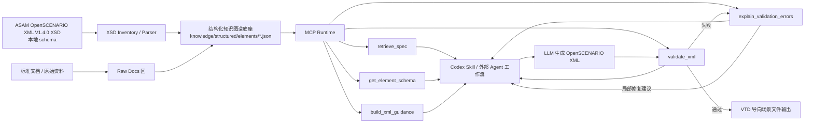
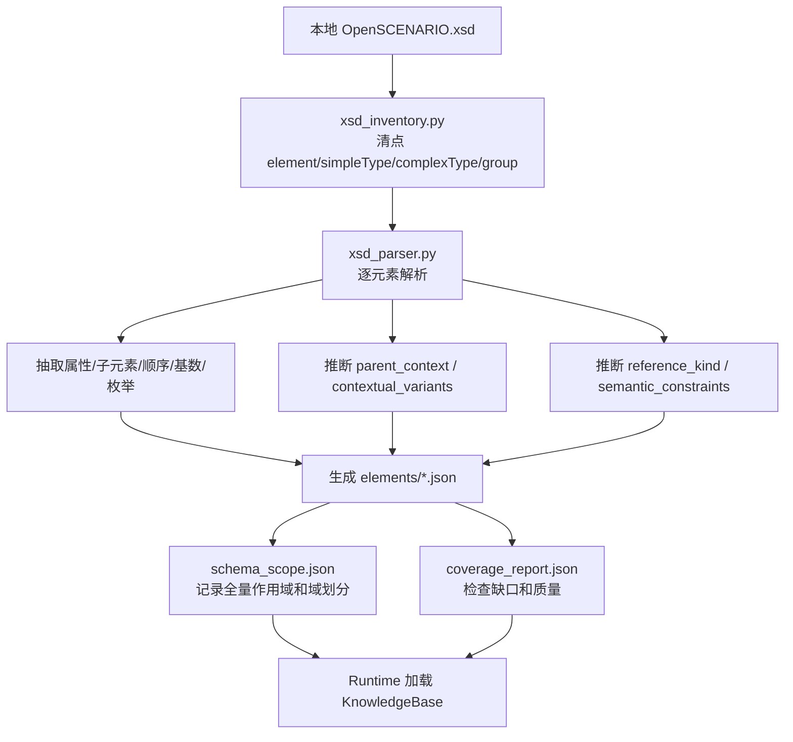
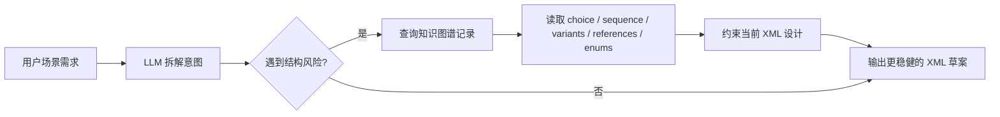
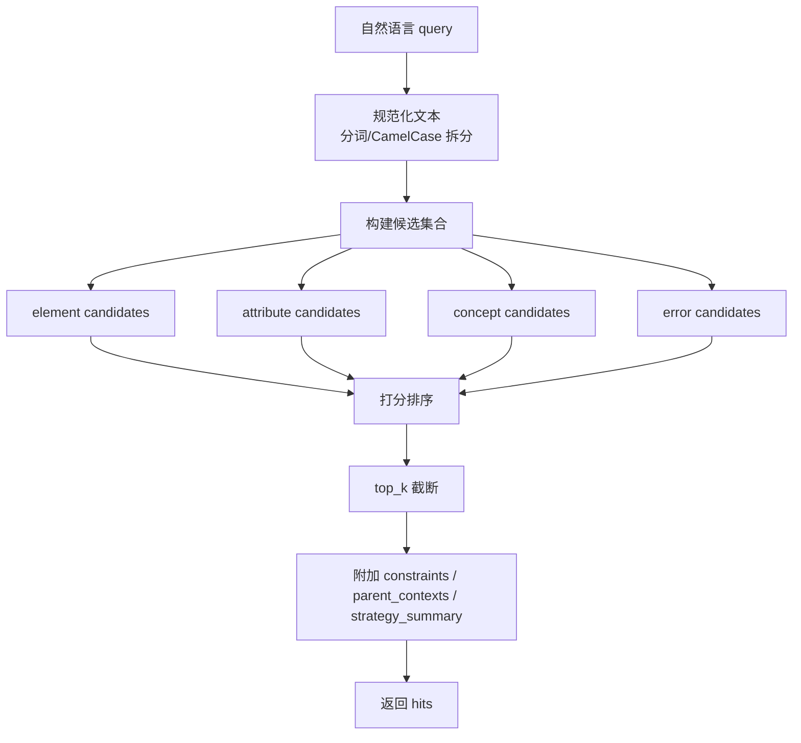
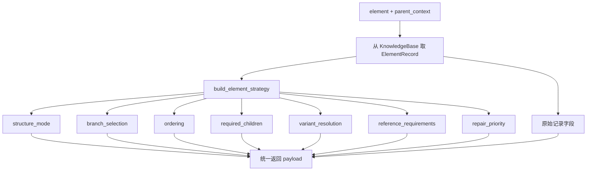
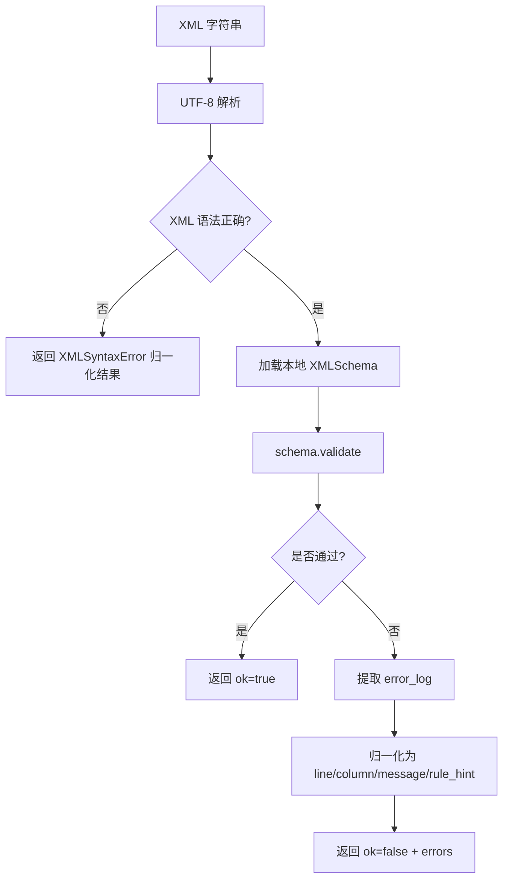
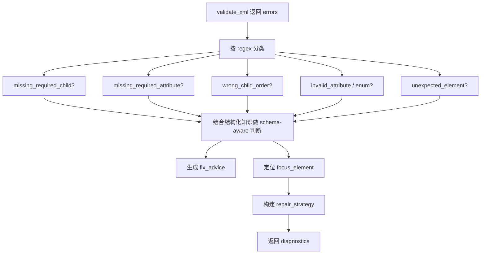
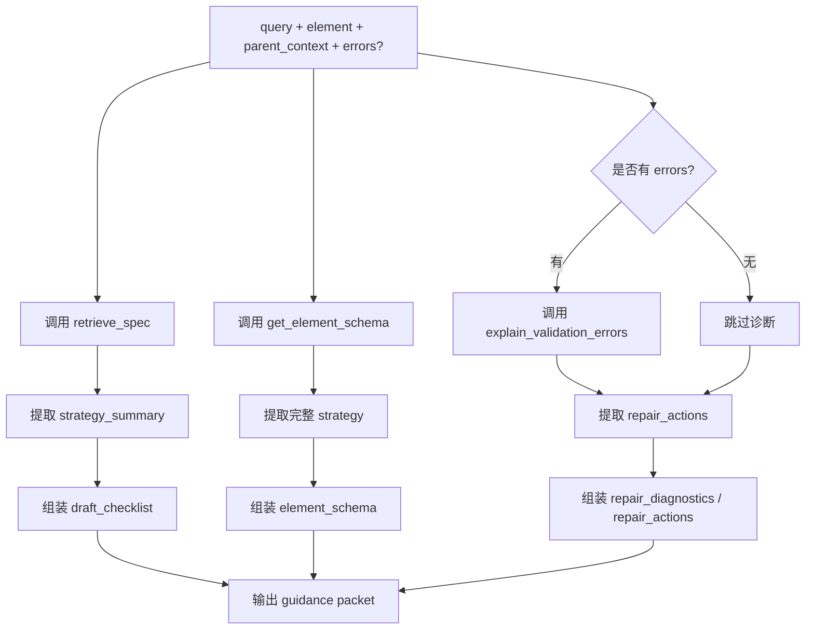
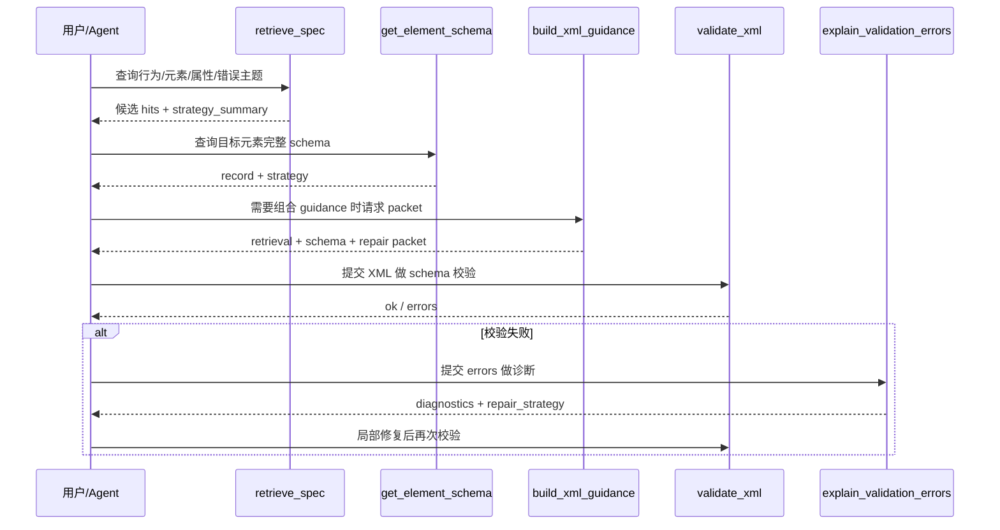
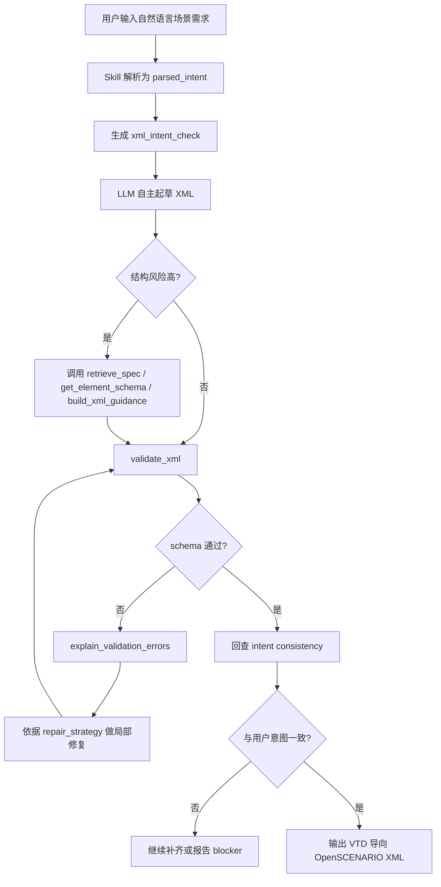

# OpenSCENARIO 智能场景生成辅助平台阶段性技术汇报

## 1. 项目概述

本项目当前建设的是一套面向 `VTD` 仿真场景开发的 `OpenSCENARIO XML` 智能生成辅助平台。平台的核心目标，不是做一个只能靠固定模板拼接 XML 的脚本工具，而是构建一个“`大模型主导决策 + MCP 提供结构化辅助 + 本地 schema 做强校验闭环`”的工程体系。

该体系解决的是 OpenSCENARIO 场景开发中的三个典型难点：

1. 规范复杂，人工查阅 `XSD`、标准文档和元素关系成本高。
2. 大模型虽然能写 XML，但容易在结构层、上下文变体、枚举、引用关系和子元素顺序上出错。
3. 传统纯规则生成器鲁棒性不足，面对开放式场景需求时缺少泛化能力。

因此，本项目采用了“`LLM-first, MCP-assisted`”技术路线：

- 大模型负责理解自然语言场景需求、设计场景逻辑、决定 XML 写法。
- MCP 只做高价值辅助，包括信息检索、schema 结构提示、校验、报错解释、修复优先级建议。
- 本地 Python 校验器负责最终语法闭环，确保输出结果可被规范验证。

从能力形态上看，这已经不是单一脚本，而是一个由“知识图谱化底座 + MCP 服务层 + Skill 工作流层 + 校验/修复闭环 + benchmark 资产”共同组成的智能场景工程平台。

## 2. 总体技术架构



### 2.1 架构分层

本项目按工程职责可以分成 5 层：

1. `原始知识层`
   包含本地 `OpenSCENARIO.xsd`、预留的标准文档区、原始校验资源。
2. `结构化知识图谱层`
   将 XSD 中的元素、属性、父子关系、choice/sequence、上下文变体、引用语义等，转成可被模型和工具直接消费的结构化 JSON 记录。
3. `MCP 服务层`
   把检索、schema 查询、验证、报错解释、组合 guidance 等能力统一暴露为 MCP 工具。
4. `Skill / Agent 工作流层`
   把 Codex 的使用方式固化成可复用工作流，让模型在关键结构风险点调用 MCP，而不是全程硬编码。
5. `验证与基准层`
   通过 benchmark、回归测试、引导包生成脚本和结果日志，形成持续验证闭环。

### 2.2 设计原则

本项目的设计原则有三个：

- `模型拥有决策自由`
  不把大模型限制成模板填空器，而是保留其对复杂场景逻辑的自主建模能力。
- `结构风险必须被机器约束`
  对 choice、sequence、上下文变体、引用字段、枚举等高风险位置，用 schema 元数据约束。
- `错误修复必须可解释、可追踪、可回放`
  所有校验失败都要进入统一的诊断与修复提示闭环，而不是靠人工猜。

## 3. 知识图谱化底座建设情况

## 3.1 建设目标

为了让大模型真正“理解” OpenSCENARIO XML，而不是只记住零散提示，本项目将 OpenSCENARIO 的结构知识做成了“`结构化知识图谱底座`”。

这里的“知识图谱”不是单纯文档切片，也不是仅靠向量检索的文本库，而是：

- 用元素作为节点；
- 用父子关系、属性关系、上下文变体、引用关系、枚举约束、顺序约束作为边与关系；
- 用 JSON 记录承载图谱信息；
- 用运行时策略生成器把静态结构再转换成动态的“生成/修复策略”。

因此它既有知识图谱的关系表达能力，又保留了工程实现上的可维护性和可追踪性。

## 3.2 当前覆盖规模

当前知识底座已经完成从本地 `ASAM OpenSCENARIO XML V1.4.0` schema 的全量抽取和落地，关键指标如下：

| 指标 | 当前结果 |
| --- | --- |
| XSD 元素名总数 | `302` |
| 磁盘结构化 JSON 文件数 | `301` |
| 实际代表的 XSD 元素名数 | `302` |
| 覆盖缺口 | `0` |
| dangling child references | `0` |
| records missing required metadata | `0` |
| 域划分数量 | `5` |

之所以是 `302` 个元素名、`301` 个 JSON 文件，是因为项目单独记录了别名冲突：

- `OpenScenario -> OpenSCENARIO`

这说明当前知识底座并不是“看起来很多”，而是已经做到了可检查、可证明的全量覆盖。

## 3.3 领域拆分与工作量

为了保证全量补齐不是一次性粗放生成，而是可审核、可分工、可迭代修正，本项目把 schema 拆成 5 个审阅域：

| 领域 | 元素数量 |
| --- | --- |
| `domain-core-entities` | `77` |
| `domain-routing-geometry` | `55` |
| `domain-actions-control` | `72` |
| `domain-conditions-values` | `42` |
| `domain-traffic-environment` | `55` |

这意味着本次工作不是只做了几个常用元素，而是对整套 OpenSCENARIO 结构进行了系统化整理、分域补全和零缺口核验。

## 3.4 单个元素记录的知识字段

结构化元素记录位于：

- `knowledge/structured/elements/*.json`

每条记录不仅包含名称和说明，还包含了可驱动生成和修复的关键字段，主要包括：

- `element`
  元素名称。
- `description`
  基于 schema 自动归纳的结构描述。
- `parent_contexts`
  该元素可能出现的父上下文。
- `required_attributes` / `optional_attributes`
  必填与可选属性集合。
- `reference_kind`
  对 `entityRef`、`parameterRef`、`variableRef`、`controllerRef`、`routeRef` 等引用属性做语义标注。
- `allowed_children`
  允许的子元素集合。
- `child_order`
  sequence 结构下的合法顺序。
- `multiplicity`
  子元素基数约束。
- `content_model_kind`
  标记当前元素是 `sequence`、`choice`、`all`、`leaf` 等哪种内容模型。
- `child_groups`
  choice 分支组定义。
- `enum_constraints`
  属性枚举值约束。
- `contextual_variants`
  同名元素在不同父上下文下对应的具体类型变体。
- `semantic_constraints`
  对 choice、deprecated 变体等附加语义约束的描述。
- `source_path`
  精确指回本地 schema 行号，实现可追溯。

这套字段设计的价值在于：它已经能支撑“大模型理解该元素怎么写、为什么这么写、遇到错误应该先修哪一类问题”。

## 3.5 知识底座的自动化构建能力

本项目没有采用手工编写 300 多个元素知识文件的方式，而是先建立了自动化抽取管线，再做结构化补强。关键组件包括：

- `src/openscenario_mcp/knowledge/xsd_inventory.py`
  负责从 XSD 中统计 element、simpleType、complexType、group 等清单。
- `src/openscenario_mcp/knowledge/xsd_parser.py`
  负责解析单个元素的结构定义，抽取属性、枚举、父上下文、内容模型、choice 分支、变体信息等。
- `knowledge/structured/schema_scope.json`
  记录全量 schema 作用域和域划分统计。
- `knowledge/structured/coverage_report.json`
  记录覆盖率、缺口、悬挂引用、缺失元数据等质量指标。

这带来两个工程价值：

1. 后续标准版本升级时，不需要从零重新整理。
2. 知识底座可重复生成、可验证、可批量扩展。

## 3.6 知识图谱层的技术亮点

本层最重要的技术先进性有 5 点：

1. `从 XSD 自动生成可计算知识，而非只做文本索引`
2. `支持上下文变体识别`
   同名元素在不同父节点下的语义差异，可直接被机器识别。
3. `支持 choice/sequence 结构显式建模`
   这是纯检索文档很难稳定做到的。
4. `支持引用语义建模`
   变量、参数、实体、控制器、轨迹、路由等引用字段被标记为具体引用类型。
5. `支持从静态结构推导动态策略`
   静态记录在运行时还能进一步生成 draft/repair strategy，直接服务大模型决策。

## 3.7 知识图谱构建流水线详解

为了让甲方更直观看到“这套知识图谱到底怎么做出来的”，下面给出实际的数据生产流水线。



这条流水线中，已经实际完成的内容包括：

1. `XSD 清点`
   用 [xsd_inventory.py](D:\wyj\OPenscenario\src\openscenario_mcp\knowledge\xsd_inventory.py) 自动统计 XSD 中的 element、simpleType、complexType、group，建立“应该覆盖什么”的基准面。
2. `逐元素解析`
   用 [xsd_parser.py](D:\wyj\OPenscenario\src\openscenario_mcp\knowledge\xsd_parser.py) 对单个元素进行结构拆解，而不是只截取原文说明。
3. `结构关系抽取`
   抽出 `required_attributes`、`optional_attributes`、`allowed_children`、`child_order`、`multiplicity`、`enum_constraints`。
4. `上下文语义抽取`
   抽出 `parent_contexts` 和 `contextual_variants`，解决“同名元素在不同父节点下语义不同”的问题。
5. `引用语义推断`
   对 `entityRef`、`variableRef`、`parameterRef`、`routeRef`、`trajectoryRef`、`controllerRef` 等属性推断 `reference_kind`。
6. `质量闭环`
   通过 [schema_scope.json](D:\wyj\OPenscenario\knowledge\structured\schema_scope.json) 和 [coverage_report.json](D:\wyj\OPenscenario\knowledge\structured\coverage_report.json) 证明当前是零缺口、零悬挂引用、零缺失必填元数据。

这意味着本项目做的不是“把文档放进库里”，而是完成了一条从规范到结构化知识资产的自动生产链。

## 3.8 知识图谱记录实例详解

下面用两个真实元素说明，这套知识图谱到底记录了什么。

### 示例 A：`Action`，典型的 choice 包装节点

文件：

- [Action.json](D:\wyj\OPenscenario\knowledge\structured\elements\Action.json)

其核心结构可以概括为：

```json
{
  "element": "Action",
  "content_model_kind": "choice",
  "child_groups": [
    {
      "members": ["GlobalAction", "UserDefinedAction", "PrivateAction"],
      "cardinality": "1..1"
    }
  ],
  "required_attributes": [
    {"name": "name", "type": "String"}
  ],
  "parent_contexts": ["Event"]
}
```

这条记录告诉模型和工具：

1. `Action` 不是普通容器，而是 `choice`。
2. 它必须在 `GlobalAction`、`UserDefinedAction`、`PrivateAction` 三个分支里恰好选择一个。
3. 它只能在 `Event` 上下文中出现。
4. 它还必须带 `name` 属性。

如果没有这种结构化表达，大模型只能从文档文字里自己猜“是不是可以把三个分支都写进去”，这类错误在纯文本检索场景里非常常见。

### 示例 B：`CatalogReference`，典型的上下文变体节点

文件：

- [CatalogReference.json](D:\wyj\OPenscenario\knowledge\structured\elements\CatalogReference.json)

其价值不在于“它有两个属性”，而在于它同时出现在多个父上下文中。当前记录里已经明确列出它可出现在：

- `AssignControllerAction`
- `AssignRouteAction`
- `ControllerDistributionEntry`
- `EntityObject`
- `EnvironmentAction`
- `FollowTrajectoryAction`
- `ManeuverGroup`
- `ObjectController`
- `RouteRef`
- `TrajectoryRef`

并且保留了：

- 必填属性：`catalogName`、`entryName`
- 可选子节点：`ParameterAssignments`
- 子节点顺序：`ParameterAssignments`
- 多个 `source_path` 行号映射

这一类元素如果只靠文本库检索，模型很容易知道“CatalogReference 大概是什么”，但很难稳定判断“当前场景里我写的这个 CatalogReference，到底挂在哪个父节点下才对”。`contextual_variants` 和 `parent_contexts` 就是在解决这个问题。

## 3.9 知识图谱如何真正服务大模型

很多项目做知识库，最终只变成“给模型多喂一点文本”。本项目的知识图谱底座不是这样用的，而是直接参与模型的结构决策。



知识图谱字段与模型收益的对应关系如下：

| 风险类型 | 对应字段 | 给模型带来的帮助 | 例子 |
| --- | --- | --- | --- |
| choice 误写 | `content_model_kind`、`child_groups` | 知道是多选一还是可多选 | `Action` 只能三选一 |
| 子元素顺序错误 | `child_order` | 避免 sequence 顺序错位 | `Storyboard` 必须 `Init -> Story -> StopTrigger` |
| 同名元素误用 | `contextual_variants`、`parent_contexts` | 知道在不同父节点下该选哪个变体 | `SetAction`、`CatalogReference` |
| 引用字段漏接或接错 | `reference_kind` | 知道是变量引用、实体引用还是轨迹引用 | `variableRef` 必须指向变量 |
| 枚举值乱填 | `enum_constraints` | 知道哪些值是合法枚举 | `dynamicsShape` 等属性 |
| 难以回溯来源 | `source_path` | 可以回到 XSD 对应行号核对 | 定位到本地 schema 行号 |

这也是为什么这套底座更接近“知识图谱驱动的智能辅助系统”，而不是传统的“文档检索问答”。

## 4. MCP 服务层建设情况

## 4.1 MCP 服务定位

本项目的 MCP 不承担“替大模型做场景设计”的职责，而是作为高价值工具层，为模型提供：

- 信息检索
- 精确 schema 查询
- 本地语法校验
- 错误分类与解释
- 结构化 guidance 组合输出

MCP 服务基于 `FastMCP` 实现，入口位于：

- `src/openscenario_mcp/server.py`

当前注册了 5 个核心 MCP 工具：

| 工具名 | 作用 |
| --- | --- |
| `retrieve_spec` | 检索元素、属性、概念、错误主题，并返回结构摘要 |
| `get_element_schema` | 返回某个元素的完整结构化 schema 记录 |
| `build_xml_guidance` | 把检索、schema、修复诊断组合成一个 guidance 包 |
| `validate_xml` | 用本地 Python validator 校验 XML |
| `explain_validation_errors` | 把原始校验错误解释成更适合修复的诊断结果 |

## 4.2 检索工具：retrieve_spec

`retrieve_spec` 的价值不在于“查到一段文本”，而在于“查到一个适合当前生成动作的结构化候选项”。

其底层实现位于：

- `src/openscenario_mcp/tools/retrieve_spec.py`
- `src/openscenario_mcp/knowledge/search.py`

能力特点包括：

- 支持 `element`、`attribute`、`concept`、`error` 四类检索；
- 支持 `parent_context`，用于区分同名元素在不同父节点下的场景；
- 返回 `strategy_summary`，让模型在拉取完整 schema 之前，先知道是否存在：
  - 变体分辨要求；
  - choice 分支选择要求；
  - child 顺序要求；
  - 必填引用要求。

这使得检索结果不再只是“告诉模型去看哪个元素”，而是提前把“写这个元素最容易踩的坑”压缩成摘要返回。

## 4.3 Schema 查询工具：get_element_schema

`get_element_schema` 用于返回单个元素的完整结构化记录，并额外附带一个关键字段：

- `strategy`

底层实现位于：

- `src/openscenario_mcp/tools/schema.py`
- `src/openscenario_mcp/generation/strategy.py`

`strategy` 不是静态存储，而是运行时根据元素结构推导出来的动态策略，核心内容包括：

- `structure_mode`
  当前元素属于 `choice`、`sequence`、`all`、`leaf` 等哪类结构。
- `branch_selection`
  choice 场景下到底是“必须选一个”、“最多选一个”还是“可选多个分支”。
- `ordering`
  子元素是否必须按 sequence 顺序输出。
- `required_children`
  哪些子元素必须出现。
- `variant_resolution`
  是否需要结合 `parent_context` 解析上下文变体。
- `reference_requirements`
  哪些引用属性必须优先接好。
- `repair_priority`
  如果后续校验失败，应优先修复哪类结构问题。

这一层是整个系统的关键创新点之一，因为它把“schema 结构”升级成了“可直接驱动生成和修复决策的 machine-readable strategy”。

## 4.4 校验工具：validate_xml

`validate_xml` 由本地 Python 真实校验器驱动，而不是模拟器或 mock。核心实现位于：

- `src/openscenario_mcp/validator/real_validator.py`

技术特征如下：

- 基于 `lxml.etree.XMLSchema` 编译本地 `OpenSCENARIO.xsd`；
- 支持 `1.4.0`、`1.4`、`1.x`、`v1.4.0`、`v1.4` 等版本别名；
- 将原始校验日志统一归一化为：
  - `line`
  - `column`
  - `message`
  - `rule_hint`

这保证了校验结果不是一段难以消费的自由文本，而是结构化错误对象，为后续诊断与修复链路提供稳定输入。

## 4.5 诊断工具：explain_validation_errors

校验通过只是闭环的一半，更难的是把失败信息转化成可修复建议。该能力由：

- `src/openscenario_mcp/validator/classifier.py`
- `knowledge/diagnostics/patterns.json`

共同实现。

目前系统已经对典型 schema 错误建立了诊断模式，包括：

- 根元素/命名空间问题
- 缺失必选子元素
- 缺失必填属性
- 非法属性
- 非法枚举值
- 子元素顺序错误
- 意外元素

更重要的是，诊断工具不仅返回人类可读的 `fix_advice`，还会结合结构化知识图谱为当前错误生成：

- `repair_strategy.focus_element`
- `repair_strategy.focus_strategy`
- `repair_strategy.expected_elements`
- `repair_strategy.recommended_actions`

这意味着系统已经能做到：

- 不只指出错了；
- 还能告诉模型“应该先修引用、先补 child、先修 choice 还是先修 sequence”。

## 4.6 组合 guidance 工具：build_xml_guidance

为了减少模型在多个工具之间反复拼装上下文的成本，本项目新增了：

- `build_xml_guidance`

实现位于：

- `src/openscenario_mcp/tools/guidance.py`

它会把三类信息一次性合并为统一 guidance 包：

1. `retrieval_hits`
2. `element_schema`
3. `repair_diagnostics / repair_actions`

这样大模型在“已知目标元素”的情况下，可以一次拿到：

- 该元素的结构风险点；
- 相关概念和错误主题检索结果；
- 当前元素的生成策略；
- 如果给了错误样例，还能拿到修复优先级。

这大幅降低了 agent 编排难度，也提高了跨会话复用能力。

## 4.7 `retrieve_spec` 模块详解

`retrieve_spec` 解决的问题不是“有没有资料”，而是“模型在当前动作前，最快应该看哪类结构信息”。

### 模块流程图



### 已经做出的能力

这个模块当前已经做出 5 类关键能力：

1. `多类型检索`
   不只检索元素，还能检索属性、概念和错误主题。
2. `自然语言到 CamelCase 元素名匹配`
   例如输入 `road network` 也能命中 `RoadNetwork`。
3. `上下文辅助判别`
   可带 `parent_context`，避免同名元素误命中。
4. `结构摘要输出`
   直接返回 `strategy_summary`，告诉模型“这个节点最需要注意什么”。
5. `来源可追踪`
   返回 `source_path` 和 `source_paths`，便于回溯到 schema 或结构化记录。

### 示例 1：查结构概念

如果查询：

```text
query = "Storyboard"
kind = "element"
```

典型返回重点会包含：

```json
{
  "title": "Storyboard",
  "kind": "element",
  "constraints": [
    "Required children: Init",
    "Child order: Init -> Story -> StopTrigger"
  ],
  "strategy_summary": [
    "Preserve child order: Init -> Story -> StopTrigger.",
    "Keep required children present: Init."
  ]
}
```

这类结果对模型的意义不是“知道 Storyboard 是什么”，而是立刻知道：

- `Init` 不能漏；
- 子节点顺序不能错；
- `StopTrigger` 不是必须；
- 该节点更像一个执行容器，而不是任意顺序的块。

### 示例 2：查属性语义

如果查询：

```text
query = "rev major"
kind = "attribute"
```

可命中 `FileHeader.revMajor`，并返回：

- 它是 `FileHeader` 的必填属性；
- 类型是 `UnsignedShort`；
- 所属上下文为 `OpenSCENARIO / FileHeader`。

这对模型补齐头部版本信息非常实用。

### 示例 3：查错误主题

如果查询：

```text
query = "missing_required_child"
kind = "error"
```

它会命中诊断模式，并返回：

- 典型修复建议；
- `strategy_summary`，例如：
  - 先补期望 child；
  - 如果父节点是 choice 包装层，就先满足 choice 分支基数。

这等于把“报错知识库”也纳入统一检索体系里了。

## 4.8 `get_element_schema` 模块详解

`get_element_schema` 是从“查得到信息”升级到“拿得到完整结构对象”的关键模块。

### 模块流程图



### 已经做出的能力

这个模块不只是“把 JSON 文件返回给调用方”，而是进一步做了动态策略生成：

1. `把静态 schema 转成动态 strategy`
2. `自动判断 choice/sequence/all/leaf`
3. `自动推导 required_children`
4. `自动识别 reference_requirements`
5. `自动根据 parent_context 解析 contextual_variants`
6. `自动生成 repair_priority`

### 示例：`SetAction` 在不同上下文的分辨

在测试中，`SetAction` 被构造为一个共享名称节点，它可能属于：

- `ParameterAction -> ParameterSetAction`，且该变体是 deprecated
- `VariableAction -> VariableSetAction`，且该变体是推荐路径

如果调用：

```text
element = "SetAction"
parent_context = "VariableAction"
```

则 `strategy.variant_resolution.resolved_variant` 会解析成：

```json
{
  "parent_context": "VariableAction",
  "type_ref": "VariableSetAction",
  "deprecated": false
}
```

同时，策略里还会给出：

- `branch_selection`: `Value` 和 `Expression` 二选一
- `reference_requirements`: 需要先接好 `variableRef`
- `repair_priority`: 优先做
  - `resolve_contextual_variant`
  - `satisfy_choice_cardinality`
  - `add_required_references`

这就是从“schema 数据”升级成“生成策略”的具体体现。

## 4.9 `validate_xml` 模块详解

`validate_xml` 是本项目最确定性的环节，它确保整个系统最终不是“看上去像 XML”，而是“能通过本地 schema 验证”。

### 模块流程图



### 已经做出的能力

1. `本地 schema 编译`
   基于 `lxml.etree.XMLSchema`，不是模拟器。
2. `版本别名归一`
   支持 `1.4.0`、`1.4`、`1.x`、`v1.4.0`、`v1.4`。
3. `错误格式标准化`
   不让上层处理 lxml 原始日志细节。
4. `rule_hint 提取`
   从错误信息里提取最有价值的结构提示。

### 示例：空的 `ManeuverGroup`

如果输入类似：

```xml
<ManeuverGroup />
```

系统会返回类似结构化错误：

```json
{
  "ok": false,
  "errors": [
    {
      "line": 7,
      "column": 4,
      "message": "Element 'ManeuverGroup': Missing child element(s). Expected is ( Actors ).",
      "rule_hint": "Actors"
    }
  ]
}
```

对上层模型来说，这种格式比原始日志更稳定，因为下一步的诊断模块可以直接消费它。

## 4.10 `explain_validation_errors` 模块详解

如果说 `validate_xml` 负责“发现错误”，那 `explain_validation_errors` 负责“把错误变成可执行修复建议”。

### 模块流程图



### 已经做出的能力

当前该模块已经不是简单的“报错翻译器”，而是做了以下增强：

1. `错误类别建模`
   覆盖根元素问题、缺 child、缺属性、非法属性、非法枚举、顺序错误、意外元素等类别。
2. `choice 场景识别`
   能判断当前缺的是“某个固定 child”，还是“必须从一组分支里选一个”。
3. `wrong_child_order 与 unexpected_element 区分`
   对看起来类似的错误，结合已知元素和 sibling 顺序上下文再做判别。
4. `引用感知修复`
   如果缺的是 `variableRef` 这类引用属性，返回 `add_required_references`，而不是笼统说“补属性”。
5. `修复优先级输出`
   返回 `repair_strategy.recommended_actions`。

### 示例 1：缺少必选子节点

错误：

```text
Element 'ManeuverGroup': Missing child element(s). Expected is ( Actors ).
```

诊断后会得到：

- `category = missing_required_child`
- `focus_element = ManeuverGroup`
- `recommended_actions = ["add_required_children", "enforce_sequence_order"]`

这说明系统知道这不是“整棵 XML 都错了”，而是优先在 `ManeuverGroup` 下补 `Actors`，并注意顺序。

### 示例 2：缺少引用属性

错误：

```text
Element 'VariableAction': The attribute 'variableRef' is required but missing.
```

诊断后会给出：

- `category = missing_required_attribute`
- `focus_element = VariableAction`
- `recommended_actions = ["add_required_references"]`

这比普通的“请补属性”更高级，因为它知道 `variableRef` 不是任意字符串字段，而是变量引用。

### 示例 3：choice 包装层缺分支

错误：

```text
Element 'PrivateAction': Missing child element(s). Expected is one of ( LongitudinalAction, LateralAction, VisibilityAction, ... ).
```

诊断后会识别为：

- 当前缺的是一组 choice 分支中的一个；
- 推荐动作是 `satisfy_choice_cardinality`。

这对大模型修复非常重要，因为它避免了模型同时塞入多个不兼容分支。

## 4.11 `build_xml_guidance` 模块详解

`build_xml_guidance` 是为了降低 agent 编排成本而做的组合层。

### 模块流程图



### 已经做出的能力

1. `统一打包`
   把检索、schema、诊断三类信息组合成一个 guidance 包。
2. `自动去重`
   对 `draft_checklist` 和 `repair_actions` 做去重处理。
3. `支持无错误与有错误两种模式`
4. `适合新会话/外部 agent 直接消费`

### 示例：面向 `VariableAction` 场景的 guidance

如果调用：

```text
query = "set action"
element = "SetAction"
parent_context = "VariableAction"
```

则 guidance 里会同时出现：

- `retrieval_hits`
  告诉模型：
  - 选 `VariableSetAction` 变体；
  - `Value / Expression` 二选一；
  - 优先接好 `variableRef`。
- `element_schema`
  给出完整结构和 `strategy`。
- `draft_checklist`
  作为当前草稿编写的最小核对清单。

如果再带上错误：

```text
Element 'VariableAction': The attribute 'variableRef' is required but missing.
```

则 guidance 还会附带：

- `repair_diagnostics`
- `repair_actions = ["add_required_references"]`

这样模型无需自己在多个工具结果之间重新拼装上下文。

## 4.12 MCP 五工具协同闭环

前面每个工具是单点能力，真正体现平台价值的是它们能形成闭环。



这条闭环说明，本项目已经做出了一个完整的“智能辅助执行链”：

1. `先找知识`
2. `再看结构`
3. `必要时拿组合 guidance`
4. `生成 XML`
5. `本地校验`
6. `结构化诊断`
7. `局部修复并重试`

因此，MCP 在本项目中不是一个单点接口，而是一整套围绕 OpenSCENARIO XML 生成与修复的结构化辅助基础设施。

## 5. Skill 与 Agent 工作流建设情况

## 5.1 Skill 定位

仅有 MCP 工具还不够，真正落地到 Codex 使用时，还需要一层“如何组织模型行为”的工作流约束。因此项目构建了：

- `skills/openscenario-xml-generator/SKILL.md`

该 Skill 的定位是：

- 面向 `VTD` 场景开发；
- 让模型保留主导权；
- 在结构风险点主动调用 MCP；
- 在校验失败时走局部修复闭环；
- 避免把整个任务退化为模板拼接。

## 5.2 Skill 固化的中间状态

为了避免“看起来生成了 XML，实际上和用户意图已经漂移”的问题，Skill 强制模型维护几类中间状态：

- `parsed_intent`
- `xml_intent_check`
- `schema_valid`
- `intent_consistent`
- `remaining_blockers`

这一步非常关键，它把自然语言需求、XML 结构、校验结果和最终交付状态串成了同一条闭环链路。

## 5.3 Skill 的工作流程



该流程最大的价值在于：

- 先由模型理解需求；
- 再由 MCP 提供必要但克制的辅助；
- 最后由本地校验器做确定性闭环。

## 5.4 面向 VTD 的工作流适配

Skill 已明确被调整为“面向 `VTD` 场景开发”的工作流，当前约束包括：

- 默认偏向保守、可运行、结构最小的 XML；
- 尽量不生成没有明确需求支撑的复杂 catalog、controller、actor 结构；
- 在不确定时优先生成 simulator-friendly 的最小合法结构；
- 将 `OpenX scene code`、`VTD scene file`、`simulation scenario file` 等短语都视作同一类任务入口。

这对甲方使用非常重要，因为实际业务输入往往不是标准化提示词，而是简短场景描述。

## 5.5 外部 Agent / 新会话复用能力

除了在 Codex 当前会话内使用，本项目还专门为“新会话接管”和“外部 agent 协作”做了支持：

- `docs/external-agent-guidance-workflow.md`
- `docs/external-agent-prompt-template.md`
- `scripts/build_guidance_packet.py`
- `scripts/build_benchmark_guidance.py`

其设计思路是先生成一个 `.guidance.json`，再把该 guidance 包与原始 prompt 一起交给新会话或外部 agent。

这意味着：

- 复杂任务可以跨会话分发；
- 关键 schema 结构风险不会在新会话中完全丢失；
- 但最终 XML 仍由大模型自主决策，而不是由 guidance 机械控制。

## 6. Benchmark、验证与工程质量

## 6.1 Benchmark 资产

项目已经建立了一套可复现的 benchmark 资产，当前至少包含 4 个典型场景提示：

- `minimal-single-vehicle`
- `two-vehicle-follow`
- `triggered-deceleration`
- `triggered-lane-change`

相关资产位于：

- `benchmarks/prompts/`
- `benchmarks/results/`
- `benchmarks/guidance-inputs.json`
- `benchmarks/intent-schema.json`

每个 benchmark 都可以：

1. 读取自然语言 prompt；
2. 生成 `.guidance.json`；
3. 让模型据此生成 XML；
4. 回写结果并进入校验。

这使得平台具备了持续回归验证的基础，而不是停留在一次性 demo。

其中 `benchmarks/intent-schema.json` 还统一约束了关键 sidecar 字段：

- `parsed_intent`
- `xml_intent_check`
- `schema_valid`
- `intent_consistent`
- `remaining_blockers`

这意味着 benchmark 不只验证“有没有生成 XML”，还验证“是否保留了意图解析、结构检查、校验状态和阻塞项描述”。

## 6.2 回归验证结果

当前项目已经完成扩展回归验证，最近一次完整结果为：

- `93 passed`

此外，benchmark 结果日志采用了 `pass / bounded_failure` 的有界状态设计，这说明当前系统并不是无限次自动修复，而是以“有边界的智能修复闭环”为原则，符合工程可控性要求。

验证范围覆盖：

- XSD inventory
- schema coverage report
- full schema scope
- generation strategy
- guidance tool / guidance runner
- benchmark guidance runner
- domain knowledge correctness
- schema tool
- retrieve_spec tool
- validate tool
- diagnostics tool
- benchmark assets
- MCP server registration
- tool loop integration
- benchmark results

这说明当前交付物不仅“功能存在”，而且已有比较完整的自动化验证基础。

## 6.3 工程质量保障机制

目前已经形成的质量保障机制包括：

- `全量覆盖核验`
  任何元素缺口、悬挂引用、元数据缺失都能在 `coverage_report.json` 中被发现。
- `结构策略测试`
  对 choice、sequence、上下文变体、修复策略等关键行为单独建测试。
- `MCP 注册与工具链集成测试`
  确保 5 个核心工具可以被完整装载和联动。
- `benchmark 结果校验`
  保证示例任务可复现、可对比、可迭代。

## 7. 交付成果清单

当前阶段已形成的核心交付物如下：

| 模块 | 主要内容 |
| --- | --- |
| 结构化知识图谱底座 | `knowledge/structured/elements/*.json`、`schema_scope.json`、`coverage_report.json` |
| XSD 解析与抽取 | `src/openscenario_mcp/knowledge/xsd_inventory.py`、`xsd_parser.py` |
| MCP 服务层 | `src/openscenario_mcp/server.py`、`tools/`、`validator/` |
| 生成/修复策略层 | `src/openscenario_mcp/generation/strategy.py`、`generation/runner.py` |
| Skill 层 | `skills/openscenario-xml-generator/SKILL.md` |
| Guidance 复用链路 | `build_xml_guidance`、`scripts/build_guidance_packet.py`、`scripts/build_benchmark_guidance.py` |
| 安装与接入文档 | `docs/codex-mcp-setup.md`、`docs/usage-guide-zh.md` |
| 外部协作文档 | `docs/external-agent-guidance-workflow.md`、`docs/external-agent-prompt-template.md` |
| 基准与结果资产 | `benchmarks/prompts/`、`benchmarks/results/`、`benchmarks/guidance-inputs.json` |

## 8. 面向甲方的技术先进性总结

从甲方视角看，本项目的先进性主要体现在以下 8 个方面：

1. `不是简单提示词工程，而是知识底座+工具链+工作流的完整系统`
2. `不是纯规则引擎，而是大模型主导决策的智能辅助架构`
3. `不是只做文本检索，而是把 OpenSCENARIO schema 转成可计算的知识图谱化结构`
4. `支持上下文变体、choice/sequence、引用语义、枚举约束等深层结构信息`
5. `支持本地 Python schema 校验，具备确定性语法闭环`
6. `支持错误分类与 repair strategy 推导，形成可解释修复链`
7. `支持通过 Skill 把能力直接接入 Codex / Agent 工作流`
8. `支持 benchmark、guidance 包、新会话接管，具备持续演进与工程化复用能力`

简言之，本项目已经把“AI 写 OpenSCENARIO XML”这件事，从一次性提示词尝试，提升为可复用、可验证、可扩展、可对接仿真业务的工程平台。

## 9. 当前阶段结论

截至当前阶段，本项目已经完成了以下关键跨越：

1. 从“零散文档 + 手工查 schema”升级到“全量结构化知识底座”。
2. 从“模型自由发挥写 XML”升级到“LLM-first + schema-aware MCP 辅助”。
3. 从“报错只能人工看”升级到“本地校验 + 错误分类 + repair strategy”。
4. 从“只能在当前会话里临时使用”升级到“Skill 化、benchmark 化、guidance 包化”的工程交付形态。

这意味着平台已经具备面向甲方业务继续深化的坚实基础。下一阶段如果继续推进，重点将不再是“能不能生成 XML”，而是：

- 针对 VTD 业务场景继续沉淀高价值模板与案例；
- 扩展更强的语义知识补充和场景约束知识；
- 增加更多真实业务 benchmark；
- 推进与仿真执行链路的更深集成。

## 10. 附：甲方可快速理解的使用方式

### 10.1 安装接入

1. 安装 Python 包：

```powershell
py -3.14 -m pip install -e .
```

2. 在 `C:\Users\EDY\.codex\config.toml` 注册 MCP：

```toml
[mcp_servers.openscenario]
command = "D:\\wyj\\OPenscenario\\scripts\\start_mcp_server.cmd"
```

3. 安装 Skill：

```powershell
py -3.14 scripts/install_codex_skill.py
```

### 10.2 使用方式

启动新 Codex 会话后，可直接输入类似需求：

```text
请使用 openscenario-xml-generator skill。
根据下面的场景描述，生成可用于 VTD 的 OpenSCENARIO 场景文件：
主车在道路中间车道匀速行驶，前方车辆在 3 秒后减速，主车保持跟车，场景在 10 秒后结束。
```

系统会按如下方式工作：

1. 大模型解析意图并设计 XML。
2. 在高风险结构点调用 MCP 检索和 schema 工具。
3. 生成 XML 后调用本地 `validate_xml`。
4. 如果失败，再调用 `explain_validation_errors` 进行局部修复。
5. 最终输出更贴近 VTD 使用需求的 OpenSCENARIO XML 文件。

---

如需进一步对甲方做演示，可优先展示以下三项材料：

- `knowledge/structured/elements/` 中的结构化元素记录；
- `src/openscenario_mcp/server.py` 暴露的 5 个 MCP 工具；
- `skills/openscenario-xml-generator/SKILL.md` 对 Codex 行为的工作流约束。
